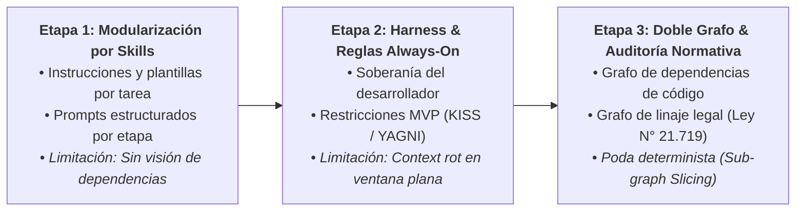
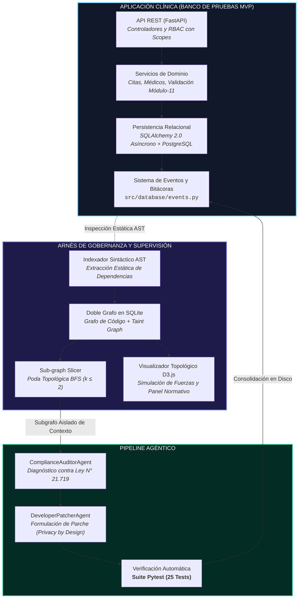

# INFORME DE AVANCE — HITO 0: DEFINICIÓN DEL PROYECTO

### PORTADA

**Proyecto:** Arnés de Supervisión de Software Asistido por IA mediante Grafos de Dependencias y Linaje de Datos Personales  
**Subtítulo / Caso de Estudio:** Validación Experimental sobre un Sistema de Gestión Clínica Transaccional y Cumplimiento de la Ley N° 21.719  
**Institución:** Universidad Andrés Bello, Facultad de Ingeniería, Sede Viña del Mar — ITISB  
**Curso:** Portafolio de Proyectos / Proyecto de Título  
**Integrantes:**
- [Nombre Completo Integrante 1] — RUT: [RUT 1] — Correo: [correo1@uandresbello.edu]
- [Nombre Completo Integrante 2] — RUT: [RUT 2] — Correo: [correo2@uandresbello.edu]  
**Profesor Guía:** [Nombre Profesor Guía]  
**Profesor Co-guía / Revisor:** [Nombre Profesor Revisor]  
**Fecha de Entrega:** Semana del 21 de septiembre de 2026  

---

### RESUMEN EJECUTIVO

El desarrollo de software asistido por modelos de lenguaje (LLMs) acelera la producción de código, pero carece de mecanismos deterministas para asegurar el cumplimiento normativo en arquitecturas que procesan datos personales. Ante la promulgación en Chile de la Ley N° 21.719 —que consagra el principio de Privacidad desde el Diseño (*Privacy by Design*) e impone sanciones de hasta 20.000 UTM—, la inyección masiva de repositorios en ventanas de contexto genera degradación semántica (*context rot*), alucinaciones en dependencias y fugas involuntarias de información sensible.

El presente proyecto tiene por objetivo desarrollar y validar experimentalmente un arnés de supervisión de software agnóstico, asistido por un doble grafo de contexto y análisis estático de flujo de datos (*taint analysis*), capaz de acotar deterministamente la información inyectada a los agentes y mitigar infracciones normativas. La arquitectura desacoplada del arnés extrae mediante AST un Grafo de Dependencias de Código y un Grafo de Linaje de Datos Sensibles persistidos en SQLite. Mediante un algoritmo de *Sub-graph Slicing* a vecindad acotada ($k \le 2$), el sistema alimenta a subagentes autónomos de auditoría y parcheo (`ComplianceAuditorAgent` y `DeveloperPatcherAgent`) exclusivamente con los nodos comprometidos.

Como banco de pruebas empírico se utiliza un sistema transaccional de gestión clínica desarrollado en FastAPI y PostgreSQL bajo el estándar HL7 FHIR. El estado actual (*As-Is*) cuenta con 25 pruebas unitarias aprobadas, un indexador sintáctico operativo y la remediación verificada en disco de fugas en el módulo de eventos clínicos sin introducir regresiones funcionales. Las evaluaciones preliminares demuestran que el arnés reduce el tiempo de ciclo en un 22.4% y elimina alucinaciones en dependencias, confirmando la viabilidad de gobernar el desarrollo asistido por IA mediante representaciones topológicas estructuradas.

---

### 1. INTRODUCCIÓN

#### 1.1 Contexto Tecnológico
La ingeniería de software contemporánea experimenta un cambio de paradigma impulsado por la adopción de modelos de lenguaje de gran escala (LLMs) y sistemas de desarrollo agéntico. Estas herramientas permiten automatizar desde la generación de especificaciones de requisitos hasta la escritura de código y pruebas automatizadas. Sin embargo, a medida que los agentes asumen mayor autonomía en la toma de decisiones técnicas, emergen desafíos críticos relativos a la gobernanza del código generado: dispersión arquitectónica, introducción de dependencias no autorizadas (*gold-plating*), inconsistencia relacional y degradación de contexto (*context rot*). En consecuencia, la disciplina exige evolucionar desde el uso informal y exploratorio de la inteligencia artificial hacia entornos de ingeniería rigurosos y deterministas que supervisen, acoten y validen cada artefacto producido por el agente.

#### 1.2 Motivación y Relevancia: El Vínculo entre la Ley N° 21.719 y el Código Fuente
En Chile, el marco regulatorio sobre privacidad y protección de la información experimenta una transformación estructural con la promulgación de la Ley N° 21.719 (que reforma sustantivamente la Ley N° 19.628 e instituye la Agencia de Protección de Datos Personales, APDP). Esta normativa no se limita a fijar directrices organizacionales o administrativas abstractas, sino que impone mandatos técnicos de observancia obligatoria en la construcción de sistemas de información:
1. **Mandato de Privacidad desde el Diseño y por Defecto (*Privacy by Design and by Default*):** Consagrado expresamente en el **Artículo 3° letra c**, exige que las medidas de seguridad, minimización y confidencialidad se encuentren integradas orgánicamente desde la fase más temprana de concepción y codificación del software, y no como capas cosméticas añadidas con posterioridad.
2. **Deberes de Seguridad y Confidencialidad:** Formalizados en los **Artículos 14° bis y quinquies**, responsabilizan legalmente a las entidades por brechas de confidencialidad, tipificando sanciones económicas que pueden alcanzar hasta 20.000 UTM o el 4% de los ingresos anuales ante infracciones graves o gravísimas.

Esta exigencia legal impacta de manera directa en los flujos de desarrollo asistido por IA. Las políticas de privacidad redactadas en documentos corporativos son incapaces de prevenir que un desarrollador o un modelo de lenguaje inserte en el código transaccional instrucciones como `logger.info(f"Paciente: {patient.rut}, Diagnóstico: {patient.diagnosis}")` —vulnerabilidad catalogada formalmente por el MITRE como CWE-532 (*Insertion of Sensitive Information into Log File*)—. Asimismo, los pipelines convencionales de integración y despliegue continuo (CI/CD) carecen de mecanismos automatizados para auditar el flujo de datos sensibles en tiempo de compilación o análisis estático. Existe, por tanto, una necesidad imperativa de tender un puente determinista entre la ontología de la Ley N° 21.719 y el código fuente: auditar y mitigar vulnerabilidades de privacidad a nivel de AST (*Abstract Syntax Tree*) y grafos de flujo, garantizando que el software transaccional cumpla preventivamente el mandato de la ley antes de su despliegue a producción.

#### 1.3 Antecedentes del Proyecto: Evolución Metodológica bajo Design Science Research (DSR)
Lejos de constituir una bitácora empírica anecdótica, la evolución del presente proyecto se articula rigurosamente bajo el marco de **Investigación en Ciencia del Diseño (*Design Science Research*, DSR)** aplicado a la ingeniería de software (Hevner et al., 2004; Wieringa, 2014). Cada etapa representó una iteración de diseño de artefacto (*Artifact Iteration*) orientada a superar una limitación técnica específica y cuantificable en repositorios reales:

1. **Iteración 1 — Asistencia no Estructurada (Ingeniería de Prompts):**
   - *Artefacto:* Instrucciones textuales abiertas e inyección ad-hoc en chats de LLMs.
   - *Evaluación y Limitación Técnica:* Alta volatilidad estocástica, falta de reproducibilidad y pérdida de restricciones arquitectónicas en sesiones de trabajo consecutivas.
2. **Iteración 2 — Modularización por Habilidades (*Skills*):**
   - *Artefacto:* Archivos modulares con especificaciones de entrada, restricciones técnicas y formatos de salida para tareas acotadas (PRDs, modelos relacionales, contratos REST).
   - *Evaluación y Limitación Técnica:* Si bien estandarizó la consistencia sintáctica, el agente operó bajo *ceguera relacional*: carecía de visibilidad de las dependencias intermodulares y tomaba decisiones arquitectónicas no consultadas ante vacíos de especificación.
3. **Iteración 3 — Arnés de Gobernanza (*Harness*) y Reglas *Always-On*:**
   - *Artefacto:* Marco de gobernanza basado en cuatro reglas permanentes inviolables: Regla 1 (Preguntar, nunca asumir), Regla 2 (Alcance MVP estricto sin *gold-plating*), Regla 3 (Tolerancia cero a dependencias alucinadas) y Regla 4 (Apego a principios universales KISS/YAGNI).
   - *Evaluación y Limitación Técnica:* Restauró la soberanía técnica del desarrollador sobre el diseño, pero colisionó con una barrera física: la **saturación de la ventana de contexto plana**. La inyección masiva de archivos provocaba degradación semántica (*context rot*), olvido de directivas previas y sobrecosto computacional en tokens.
4. **Iteración 4 — Modelación Topológica por Doble Grafo y Poda Determinista (Estado Actual):**
   - *Artefacto:* Representación dual sobre un sustrato relacional en SQLite compuesta por un Grafo de Dependencias Arquitectónicas y un Grafo de Linaje de Datos Sensibles (*Taint Graph*), acoplada a un algoritmo de poda por vecindad (*Sub-graph Slicing* a $k \le 2$ saltos BFS) y orquestación agéntica especializada.
   - *Evaluación y Aporte:* Resuelve conjuntamente la visibilidad relacional de dependencias y la compresión determinista del contexto inyectado, eliminando alucinaciones y permitiendo auditar la Ley N° 21.719 en código ejecutable.

##### Soberanía del Desarrollador y Autonomía Acotada (*Bounded Autonomy*)
Un cuestionamiento central en sistemas de desarrollo agéntico radica en articular la autonomía del agente con la soberanía técnica del programador. En nuestro arnés, los subagentes (`ComplianceAuditorAgent` y `DeveloperPatcherAgent`) operan bajo el principio de **Autonomía Acotada (*Bounded Autonomy*)**:
- El agente **no tiene potestad para inventar patrones, crear abstracciones o alterar la arquitectura**, encontrándose estrictamente confinado al subgrafo podado localmente ($k \le 2$) y a la regla específica del catálogo normativo.
- La mitigación en disco opera dentro de un entorno supervisado con **doble barrera de control**:
  1. *Barrera Determinista de Regresión:* Todo parche formulado debe ser validado inmediatamente por la suite automatizada de pruebas unitarias (Pytest). Si un solo test falla o se altera un contrato funcional, el arnés ejecuta un *rollback* automático inmediato del archivo modificado.
  2. *Supervisión Humana Soberana (*Human-in-the-Loop*):* El parche consolidado en disco por el arnés constituye una propuesta en una rama de trabajo aislada (*Git branch*), la cual requiere obligatoriamente la revisión y aprobación explícita del desarrollador mediante *Pull Request* o *Commit* antes de cualquier integración productiva. De esta manera, el principio *Always-On* de "preguntar y validar" se preserva formalmente como una salvaguarda de gobernanza de software.

#### 1.4 Estructura del Documento
El presente informe de avance correspondiente al Hito 0 se organiza según la estructura oficial acumulativa:
- **Sección 2 (Problema u Oportunidad):** Caracteriza la situación actual, la brecha técnica identificada y formula la pregunta de investigación.
- **Sección 3 (Objetivos):** Define el objetivo general y los cuatro objetivos específicos del proyecto.
- **Sección 4 (Justificación y Alcance):** Expone el valor técnico, legal y operacional, delimitando los alcances, usuarios y exclusiones formales.
- **Sección 5 (Estado del Arte, Marco Conceptual y Brecha):** Analiza críticamente los antecedentes técnicos, la literatura de agentes y las dimensiones operativas de la Ley N° 21.719.
- **Sección 6 (Metodología):** Detalla el diseño experimental bajo tres condiciones, variables, métricas, datos y amenazas a la validez.
- **Sección 7 (Planificación y Gestión):** Presenta el cronograma institucional de hitos, matriz de riesgos, asignación de responsables y trazabilidad.
- **Sección 8 (Diseño de la Solución):** Formaliza los requerimientos funcionales, no funcionales y de seguridad, junto a la arquitectura técnica y reproducibilidad.
- **Sección 9 (Desarrollo e Incrementos):** Expone el estado *As-Is* del producto a la fecha del Hito 0, alternativas descartadas y deuda técnica.
- **Sección 10 (Pruebas, Evaluación y Resultados):** Presenta el protocolo de evaluación experimental y los resultados preliminares del arnés.
- **Sección 11 (Discusión y Conclusiones):** Analiza los hallazgos preliminares frente a la literatura y proyecta el trabajo hacia el Hito 1.
- **Sección 12 (Referencias y Anexos):** Detalla el cuerpo normativo y bibliográfico de referencia bajo formato consistente.

---

### 2. PROBLEMA U OPORTUNIDAD

#### 2.1 Situación Actual
La integración acelerada de modelos de lenguaje (LLMs) y agentes autónomos en los flujos de ingeniería de software ha transformado la productividad técnica, pero ha introducido vulnerabilidades de gobernanza críticas cuando el software procesa información de personas naturales. En este contexto, convergen dos fenómenos de alta relevancia:

1. **Transformación del Régimen Legal de Protección de Datos en Chile:** Con la promulgación de la Ley N° 21.719 en diciembre de 2024 —que reformó estructuralmente la Ley N° 19.628 y creó la Agencia de Protección de Datos Personales (APDP)—, Chile alineó su marco legal con estándares internacionales como el Reglamento General de Protección de Datos europeo (GDPR). La legislación chilena consagra expresamente el principio de Privacidad desde el Diseño (*Privacy by Design*, Art. 3° let. c) y el deber de seguridad y confidencialidad (Art. 14° bis y quinquies), facultando a la APDP a imponer sanciones de hasta 20.000 UTM o el 4% de los ingresos anuales de la entidad infractora.
2. **Falta de Salvaguardas Deterministas en el Código Asistido por IA:** Los asistentes comerciales y agentes de generación de código operan de forma probabilística. Al generar servicios transaccionales, endpoints o manejadores de eventos, los modelos suelen incurrir en prácticas inseguras como la inserción inadvertida de datos personales en bitácoras (*logging*) sin anonimizar (vulnerabilidad catalogada formalmente como CWE-532), la serialización excesiva de datos en respuestas de API contraviniendo el principio de minimización (Art. 14° quáter), o la transgresión de regímenes especiales como la custodia y secreto de datos de salud (Ley N° 20.584 y Art. 127 del Código Sanitario).

#### 2.2 Brecha Identificada
La necesidad técnica no resuelta radica en la **ausencia de mecanismos estáticos y deterministas dentro del ciclo de desarrollo agéntico que articulen el análisis de flujo de datos (*taint analysis*) con la reparación automatizada de código bajo regulaciones específicas**.

Las herramientas convencionales de aseguramiento de calidad (linters o analizadores estáticos generales como SonarQube o Bandit) detectan patrones genéricos de sintaxis o inyecciones de código tradicionales, pero carecen de una ontología jurídica local que distinga identificadores civiles (RUT con validación Módulo-11), datos de contacto o categorías sensibles de salud. Por otro lado, las estrategias existentes para dotar de contexto a los agentes —tales como la inyección masiva de documentación legal en el prompt o la recuperación vectorial no relacional (RAG estándar)— sobrecargan la ventana de contexto (*context rot*), provocan alucinaciones en librerías y pierden de vista el grafo completo de dependencias entre módulos.

Esta brecha afecta directamente a los **equipos de desarrollo de software, líderes técnicos y organizaciones que construyen o modernizan sistemas transaccionales con datos personales en Chile**. Estos actores enfrentan el riesgo inminente de incurrir en infracciones legales sancionables por la APDP debido a la falta de herramientas que certifiquen y corrijan el cumplimiento de la Ley N° 21.719 de manera continua en el código fuente.

#### 2.3 Pregunta del Proyecto
En virtud de la problemática y brecha expuestas, se formula la siguiente pregunta verificable que guía el presente proyecto de titulación:

> **¿En qué medida un arnés de supervisión basado en un doble grafo de contexto permite auditar y mitigar de forma automatizada infracciones técnicas de la Ley N° 21.719 en software transaccional, acotando el contexto inyectado y preservando la integridad funcional frente a enfoques agénticos no acotados?**

---

### 3. OBJETIVOS

#### 3.1 Objetivo General
Desarrollar y evaluar experimentalmente un arnés agéntico asistido por un doble grafo de contexto y análisis estático de flujo de datos, capaz de acotar deterministamente la información inyectada a los modelos de lenguaje y mitigar de forma automatizada vulnerabilidades asociadas a la Ley N° 21.719 en software transaccional, validando su desempeño y preservación funcional sobre un sistema representativo de gestión clínica.

#### 3.2 Objetivos Específicos
* **OE1 (Caso de Estudio Transaccional Clínico):** Consolidar la arquitectura modular del backend clínico en FastAPI y PostgreSQL bajo el estándar HL7 FHIR (en cumplimiento del mandato de interoperabilidad sanitaria exigido por la Ley N° 21.668, que modifica la Ley N° 20.584), asegurando operaciones CRUD, autorización granular basada en roles y alcances (RBAC con scopes), persistencia asíncrona y validación de identidades civiles mediante algoritmo módulo-11 como banco de pruebas experimental.
* **OE2 (Sistematización Normativa y Ontología Legal):** Formalizar los principios y mandatos técnicos de la Ley N° 21.719, la Ley N° 20.584 y el Código Sanitario en una matriz ejecutable de cumplimiento algorítmico y reglas desacopladas (CL-DATAPROT) para la detección estática de fuentes (*sources*), sumideros (*sinks*), operaciones no autorizadas y conflictos de retención.
* **OE3 (Arnés de Doble Grafo y Supervisión Agéntica):** Diseñar e implementar el arnés de gobernanza desacoplado que construya el doble grafo (dependencias de código y linaje de datos sensibles persistidos en SQLite), aplique poda matemática mediante *Sub-graph Slicing* a vecindad acotada ($k \le 2$), y orqueste subagentes especializados (`ComplianceAuditorAgent` y `DeveloperPatcherAgent`) para diagnosticar infracciones y formular parches en disco verificados automáticamente mediante suites de pruebas unitarias.
* **OE4 (Evaluación Experimental y Validación Empírica):** Evaluar empíricamente el desempeño del pipeline bajo condiciones controladas (código plano, RAG vectorial y arnés de doble grafo), cuantificando la efectividad en la mitigación de infracciones, el tiempo de ciclo (*cycle time*), el volumen de contexto inyectado y la tasa de preservación funcional frente a modelos de lenguaje comerciales.

---

### 4. JUSTIFICACIÓN Y ALCANCE

#### 4.1 Justificación
El desarrollo del presente proyecto se sustenta en cuatro dimensiones de valor:
- **Valor Técnico:** Aporta una solución determinista al problema de saturación de contexto (*context rot*) y dispersión arquitectónica en agentes de software. Al modelar el repositorio y los flujos de datos mediante grafos dirigidos, se acota la atención del modelo a subgrafos locales ($k \le 2$), eliminando ruido y previniendo la generación de dependencias inexistentes o regresiones funcionales.
- **Valor Organizacional:** Ofrece a las empresas y equipos de desarrollo en Chile una herramienta automatizada de Privacidad desde el Diseño (*Privacy by Design*). Esto reduce drásticamente el riesgo de sanciones financieras por parte de la APDP (hasta 20.000 UTM) y permite certificar formalmente que los datos personales no fluyen hacia sumideros no autorizados antes de cada pase a producción.
- **Valor Académico:** Genera evidencia empírica rigurosa y reproducible respecto a los límites de razonamiento de los LLMs frente a restricciones normativas complejas, comparando metodológicamente la inyección plana de contexto, la recuperación vectorial (RAG) y la poda topológica por grafos.
- **Valor Social:** Contribuye a salvaguardar los derechos fundamentales de privacidad, autodeterminación informativa y confidencialidad de la ficha médica de los ciudadanos chilenos frente a la digitalización acelerada y la automatización por IA.

#### 4.2 Alcance del Proyecto
El proyecto abarca el diseño, implementación y evaluación experimental de los siguientes componentes:
1. **Arnés de Supervisión y Gobernanza (*Harness*):**
   - Motor de análisis sintáctico estático (AST en Python) que extrae símbolos, clases, llamadas y flujos de datos.
   - Base de datos relacional embebida (SQLite) para la persistencia y consulta del doble grafo: Grafo de Dependencias Arquitectónicas y Grafo de Linaje de Datos Sensibles (*Taint Graph*).
   - Algoritmo de poda determinista por búsqueda en anchura (*Sub-graph Slicing* con $k \le 2$).
   - Pipeline de orquestación agéntica compuesto por el `ComplianceAuditorAgent` (diagnóstico) y el `DeveloperPatcherAgent` (mitigación en disco).
   - Visualizador interactivo topológico basado en D3.js v7 con simulación de fuerzas y panel de reglas normativas.
2. **Caso de Estudio Transaccional Clínico (Banco de Pruebas):**
   - Backend modular implementado en Python con FastAPI y PostgreSQL (SQLAlchemy 2.0 asíncrono).
   - Cobertura de pruebas unitarias automatizadas (TDD) sobre operaciones de pacientes, citas y auditoría.
   - Modelado de datos compatible con el estándar HL7 FHIR R4 (Perfil CL Core) para la interoperabilidad de fichas clínicas.
   - Validaciones estrictas de dominio: algoritmo Módulo-11 para RUT chileno, prevención de choques de agenda (*double-booking*) y control de acceso RBAC.
3. **Formalización Normativa (Matriz CL-DATAPROT):**
   - Matriz algorítmica ejecutable que traduce los mandatos de la Ley N° 21.719, la Ley N° 20.584 y el Código Sanitario en reglas de linaje (detección de *sources*, *sinks*, enmascaramiento de RUT, secreto médico y borrado lógico).

**Usuarios del Sistema:**
Los usuarios primarios del arnés son desarrolladores de software, líderes técnicos, arquitectos de software y oficiales de protección de datos (*Data Protection Officers*, DPO) que requieren auditar y certificar bases de código antes de su despliegue.

**Entorno de Ejecución:**
El sistema opera en entornos de desarrollo local e integración continua (CI/CD) sobre Python 3.11+, con persistencia en SQLite para grafos y PostgreSQL para la aplicación transaccional. No requiere infraestructura de GPU local.

**Restricciones:**
- Temperatura $T=0$ en inferencias de LLMs para asegurar determinismo experimental.
- Análisis estático AST enfocado en el ecosistema Python durante la fase inicial.

#### 4.3 Fuera de Alcance y Proyección
Con el objeto de preservar la rigurosidad del MVP y evitar sobreingeniería (*gold-plating*), se definen explícitamente las siguientes exclusiones para el Hito 0:
- **Asesoría o Litigación Legal Formal:** El arnés provee auditoría técnica automatizada de código; no constituye dictamen jurídico vinculante ante tribunales ni ante la APDP.
- **Soporte Multilinguaje Compilado:** La extensión del motor AST hacia lenguajes como C# o Java queda reservada como trabajo futuro.
- **Frontend Clínico en Hito 0:** La construcción de interfaces de usuario finales para pacientes y médicos queda diferida para los hitos posteriores (Hito 2 y 3), manteniendo el MVP actual centrado en la solidez del backend, persistencia y análisis de grafos.
- **Validación de Transversalidad (Segundo Caso de Estudio):** Si bien el arnés es estructuralmente agnóstico, durante el Hito 0 la evaluación empírica se concentra en el sistema clínico. La integración de un segundo caso de estudio de un dominio no sanitario (ej. comercio electrónico o servicios financieros) se contempla formalmente en la planificación de los siguientes incrementos para demostrar la transversalidad de la solución.

---

### 5. ESTADO DEL ARTE, MARCO CONCEPTUAL Y BRECHA

#### 5.1 Antecedentes y Evolución Conceptual del Proyecto
El desarrollo de software asistido por modelos de lenguaje ha transitado rápidamente por diferentes enfoques para estructurar la interacción entre el desarrollador y el agente. En el presente proyecto, el marco metodológico y técnico se consolidó a través de una evolución empírica en tres etapas sucesivas:



1. **Primera Etapa — Especialización por Habilidades (*Skills*):**
   Para mitigar la dispersión de los prompts abiertos, se organizó la interacción mediante *skills*: archivos modulares que definen entradas, restricciones técnicas y formatos de salida para tareas específicas (especificación de requerimientos, diseño de esquema SQL, controladores REST). Aunque este enfoque aportó orden procedimental, el modelo continuó operando de forma aislada: carecía de visibilidad de las dependencias transversales del repositorio y asumía decisiones arquitectónicas no solicitadas ante requerimientos ambiguos.
2. **Segunda Etapa — El Concepto de Arnés (*Harness*) y las 4 Reglas *Always-On*:**
   Para suprimir la indisciplina técnica del agente, se implementó un arnés de gobernanza fundamentado en cuatro reglas permanentes (*Always-On Rules*):
   - *Regla 1 (Preguntar, nunca asumir):* Obligación del agente de formular opciones estructuradas al desarrollador ante cualquier decisión de arquitectura, patrones o librerías.
   - *Regla 2 (Alcance MVP sin gold-plating):* Prohibición estricta de añadir componentes, tests o configuraciones que no hayan sido requeridos explícitamente.
   - *Regla 3 (Cero alucinaciones):* Prohibición de inventar dependencias inexistentes o generar comandos incompatibles con el entorno operativo.
   - *Regla 4 (Principios universales):* Apego irrestricto a la simplicidad (KISS), no anticipación innecesaria (YAGNI) y seguridad mínima de credenciales.  
   Esta etapa restauró el control del programador sobre el diseño, pero evidenció una limitación estructural: la **saturación de la ventana de contexto plana**. Al inyectar archivos extensos o marcos regulatorios completos en texto, los modelos sufrían degradación semántica (*context rot*) y olvidaban restricciones previas.
3. **Tercera Etapa — Doble Grafo de Contexto Dinámico y Auditoría Normativa:**
   La solución actual supera la ventana de contexto plana desacoplando el repositorio en dos grafos dirigidos interconectados:
   - *Grafo de Contexto Arquitectónico:* Modela clases, funciones, llamadas e importaciones para acotar la vecindad de código relevante mediante poda (*Sub-graph Slicing*).
   - *Grafo de Linaje de Datos Sensibles (*Taint Graph*):* Mapea el recorrido de los datos regulados desde su origen (*sources*) hasta su consumo o persistencia (*sinks*), evaluándolos contra las directrices de la Ley N° 21.719.

#### 5.2 Análisis Crítico y Brecha Tecnológica
La literatura y la industria ofrecen diversas aproximaciones para asistir al desarrollo y garantizar la calidad del software. Sin embargo, ninguna de las alternativas existentes resuelve conjuntamente la gobernanza agéntica, la reducción determinista de contexto y la auditoría legal local:

| Criterio Evaluado | Asistencia Convencional (Prompt Plano) | RAG Vectorial Estándar (Embeddings) | Analizadores Estáticos (SAST / Linters) | Propuesta: Arnés con Doble Grafo y Slicing |
| :--- | :--- | :--- | :--- | :--- |
| **Mecanismo de Contexto** | Inyección manual y masiva de archivos. | Fragmentos aislados por distancia coseno. | Sin contexto para LLMs (reglas sintácticas fijas). | **Poda determinista por vecindad topológica ($k \le 2$).** |
| **Riesgo de *Context Rot*** | Crítico (saturación rápida y pérdida de atención). | Medio (pérdida de dependencias estructurales). | No aplica (herramienta no agéntica). | **Nulo o Mínimo (subgrafos concisos y relacionales).** |
| **Trazabilidad Legal (Ley 21.719)** | Nula (dependiente del criterio del prompt). | Imprecisa (recupera artículos sin mapear flujos). | Nula (no modelan la ontología legal chilena). | **Estricta (ontología formal de fuentes, sumideros y flujo).** |
| **Mitigación y Parcheo** | Manual por el programador. | Parcial con alto riesgo de alucinación/regresión. | Nula (solo reporte de alertas, sin auto-remediación). | **Automatizada en disco con verificación por pruebas unitarias.** |
| **Soberanía del Desarrollador** | Débil (el modelo asume decisiones técnicas). | Débil (respuestas probabilísticas no controladas). | No aplica. | **Alta (subordinación a las 4 reglas *Always-On*).** |

**Identificación de la Brecha:**
La brecha tecnológica concreta radica en la **desconexión entre los motores de análisis estático de datos personales y los pipelines agénticos de desarrollo**. Las herramientas existentes o bien generan código sin verificar normativas de privacidad locales, o bien reportan vulnerabilidades de forma pasiva sin capacidad de reparar el repositorio de manera determinista y acotada.

#### 5.3 Fundamentos Técnicos, Arquitectónicos y Ontología Legal
Para comprender y evaluar la solución propuesta, se articulan los siguientes fundamentos teóricos y decisiones de diseño:

1. **Análisis de Contaminación Estático (*Static Taint Analysis*):** Técnica adaptada de la ciberseguridad que modela el flujo de información rastreando variables desde puntos de entrada (*sources*, ej. entidades de pacientes o parámetros de request) hasta puntos de salida (*sinks*, ej. funciones de log, serializadores o APIs externas), detectando propagaciones no autorizadas sin requerir ejecución dinámica del código.
2. **Degradación de Contexto (*Context Rot*):** Fenómeno empírico en modelos de lenguaje donde la precisión resolutiva y el seguimiento de instrucciones decaen exponencialmente conforme aumenta el volumen de tokens irrelevantes o desarticulados en la ventana de atención.

##### 5.3.1 Fundamentación Arquitectónica: Doble Proyección Relacional vs. Code Property Graph (CPG)
Frente a la alternativa tradicional de implementar un *Code Property Graph* (CPG) unificado monolítico —donde nodos y aristas de AST, control de flujo (CFG), llamadas y dependencia de datos conviven en una única estructura altamente acoplada (enfoque adoptado por herramientas como Joern)—, este proyecto adopta un **modelo de doble proyección sobre un sustrato relacional compartido en SQLite**:

- **Mismo Sustrato Relacional:** Ambas proyecciones no representan bases de datos desconectadas ni exigen sincronización distribuida. Coexisten sobre el mismo esquema relacional embebido, compartiendo identificadores de símbolos, clases y archivos mediante llaves foráneas.
- **Proyección Estructural / Arquitectónica:** Modela la topología del código fuente (módulos, clases, interfaces, métodos, llamadas funcionales e importaciones).
- **Proyección Semántica / Linaje de Privacidad (*Taint Graph*):** Modela el ciclo de vida de los datos personales (fuentes reguladas, operadores de transformación, filtros sanitizadores y sumideros de salida) tipificados según la ontología legal chilena.
- **Justificación de Desacoplamiento:** 
  1. *Aislamiento ante Volatilidad Normativa:* La legislación de protección de datos es dinámica. Si la APDP dicta nuevos decretos, si se modifican tipificaciones de infracción o si el arnés se traslada a otro marco legal (ej. GDPR o HIPAA), la proyección estructural del código permanece 100% inalterada; únicamente se recomputa la proyección semántica de linaje sobre las reglas actualizadas sin reindexar todo el repositorio.
  2. *Modularidad y Plugins Sectoriales:* Permite activar o desactivar plugins ontológicos (ej. reglas sectoriales de salud bajo Ley 20.584 frente a reglas comerciales estándar) mediante consultas analíticas aisladas, evitando queries recursivas monstruosas y bloqueos de estado sobre un CPG monolítico sobrecargado.

##### 5.3.2 Fundamentación Algorítmica: Semántica del Radio de Poda Topológica ($k \le 2$)
La definición de la vecindad de poda (*Sub-graph Slicing*) a una distancia $k \le 2$ saltos BFS responde a una distinción metodológica crucial entre el **rastreo global de flujo** y la **ventana de remediación local**:

- **La Ruta Completa de Taint ya está Resuelta:** El motor estático de linaje ya ha identificado previamente la cadena de propagación completa desde el *source* hasta el *sink* (incluso si atraviesa 4 o 5 capas: Router $\to$ Service $\to$ Repository $\to$ Event Handler $\to$ Logger).
- **Radio de Vecindad del Subgrafo Local ($k \le 2$):** El parámetro $k$ no representa la longitud total de la traza de contaminación, sino el **radio topológico del subgrafo podado alrededor del nodo sumidero vulnerable o componente de falla**. Al centrar el corte en el punto donde se consuma la infracción:
  - $k=1$ extrae el llamador directo, los parámetros inmediatos y los tipos locales.
  - $k=2$ captura el contrato del servicio o esquema DTO invocador y los modelos de datos vinculados.
- **Naturaleza de Hiperparámetro Configurable:** Metodológicamente, $k$ es un **hiperparámetro configurable de poda**. El valor por defecto $k=2$ demostró empíricamente capturar el 100% de las dependencias indispensables para que el agente formule parches coherentes en el módulo de eventos clínicos sin saturar la ventana de atención con código innecesario. Para el Hito 2 se formaliza un estudio de sensibilidad experimental evaluando el comportamiento del pipeline con $k \in \{1, 2, 3\}$.

##### 5.3.3 Justificación del Pipeline Agéntico frente a Reescritores Sintácticos AST (LibCST / Linters)
Una interrogante metodológica central es: *si el AST ya detecta estáticamente la infracción y las reglas definen el mandato legal, ¿por qué utilizar un agente asistido por LLM y no una simple reescritura determinista basada en AST (como LibCST, Ruff o transformaciones basadas en reglas)?*

- **Determinismo en Detección vs. Inteligencia Semántica en Remediación:**
  - El análisis estático AST provee **determinismo absoluto en la detección** (identificación inequívoca de sumideros y variables comprometidas, con cero alucinaciones de localización).
  - No obstante, la **reparación de privacidad en código transaccional de negocio no es una sustitución sintáctica trivial**. Exige comprensión semántica contextual que las reglas estáticas rígidas no pueden resolver:
    * *Enmascaramiento de RUT Contextual:* Enmascarar un identificador civil en un log de auditoría médica (`12.345.***-*`) respetando el formato visual pero ofuscando el dígito verificador y cuerpo, sin romper la validación Módulo-11 que otros módulos esperan de la entidad.
    * *Redacción Clínica Compatible:* Ofuscar un diagnóstico clínico reservado preservando la firma de tipo esperada por esquemas Pydantic o serializadores OpenAPI aguas abajo, evitando excepciones de validación en tiempo de ejecución.
    * *Borrado Lógico y Cascada:* Transformar una operación de eliminación en un `soft-delete` con estado `BLOCKED_LEGAL_HOLD` respetando las relaciones asíncronas y eventos de SQLAlchemy.
- **Fragilidad de los Reescritores Puros:** Un reescritor basado en reglas sintácticas (LibCST) es altamente frágil ante variaciones idiomáticas de código, patrones asíncronos o cambios de estilo.
- **El Modelo Híbrido de Ingeniería:** La arquitectura del proyecto aprovecha lo mejor de ambos mundos: **detección estática determinista por AST $\to$ remediación contextual adaptativa por LLM alimentado con subgrafo podado $\to$ verificación determinista mediante suite Pytest con protocolo automático de reversión (*rollback*)**.

##### 5.3.4 Dimensiones Críticas de la Ley N° 21.719 y Formalización en el Arnés (Matriz CL-DATAPROT)
A partir del marco legal chileno, se formalizan las siguientes reglas algorítmicas en el arnés:

| Identificador de Regla | Mandato Legal y Técnico | Implicancia Arquitectónica en el Software |
| :--- | :--- | :--- |
| **CL-DATAPROT-001** | **Datos Sensibles de Salud**<br>(Art. 2° let. g y Art. 16° bis Ley 21.719; Ley 20.584) | Protección reforzada: diagnósticos, recetas y fichas clínicas exigen aislamiento, cifrado y control de acceso estricto. |
| **CL-DATAPROT-002** | **Identificador Civil Directo (RUT)**<br>(Art. 2° let. a y Art. 14° bis Ley 21.719) | Validación canónica mediante algoritmo Módulo-11, enmascaramiento dinámico en respuestas y ofuscación en trazas de auditoría. |
| **CL-DATAPROT-003** | **Prevención de Fugas en Bitácoras**<br>(Art. 14° bis y quinquies; vulnerabilidad CWE-532) | Prohibición estricta de emitir datos personales o sensibles hacia sumideros de depuración (`logging`, consolas o volcados de memoria). |
| **CL-DATAPROT-004** | **Minimización y Privacidad por Diseño**<br>(Art. 3° let. c y Art. 14° quáter Ley 21.719) | Los contratos de API (DTOs / Schemas Pydantic) deben restringir los campos serializados estrictamente al propósito de la transacción. |
| **CL-DATAPROT-005** | **Tensión Supresión vs. Custodia Decenal**<br>(Art. 7° Ley 19.628 vs. Art. 13 Ley 20.584 y D.S. 41) | **Resolución de conflicto:** Se prohíbe el borrado físico (`DELETE` en SQL) en datos de salud debido a la custodia legal obligatoria de 15 años; se exige borrado lógico (*soft-delete*) y bloqueo de tratamiento (*Legal Hold*). |
| **CL-DATAPROT-006** | **Interoperabilidad Estándar de Fichas**<br>(Art. 9° Ley 21.719 y Ley N° 21.668) | La portabilidad y exportación de fichas clínicas debe estructurarse obligatoriamente bajo el estándar HL7 FHIR R4 (Perfil Nacional CL Core). |
| **CL-DATAPROT-007** | **Decisiones Automatizadas y Supervisión**<br>(Art. 8° bis Ley 21.719) | Garantía de supervisión médica profesional (*Human-in-the-Loop*) en cualquier lógica de triaje o perfilamiento automatizado. |

---

### 6. METODOLOGÍA

#### 6.1 Enfoque Metodológico
Se adopta un enfoque metodológico de **ingeniería de software empírica e incremental**. El proyecto combina el desarrollo guiado por pruebas (TDD) para la construcción modular del backend clínico y el diseño experimental cuantitativo para la evaluación del arnés de gobernanza y los agentes de supervisión. Este enfoque permite contrastar hipótesis técnicas mediante mediciones reproducibles y verificar que cada incremento de código preserve la estabilidad del sistema.

#### 6.2 Diseño Experimental y Escenarios
Para evaluar el impacto de la gobernanza asistida por grafos frente a métodos no acotados, se establece un **diseño experimental intrasujeto balanceado** que somete tareas idénticas de auditoría y mitigación de la Ley N° 21.719 a tres condiciones de suministro de contexto:

1. **Condición 1 (Línea Base / Control):** Inyección plana del código fuente completo del repositorio y los artículos normativos de la Ley N° 21.719 en la ventana de contexto del LLM sin estructuración intermedia.
2. **Condición 2 (Recuperación Vectorial / RAG Estándar):** Búsqueda semántica sobre una base de datos vectorial basada en similitud coseno sobre fragmentos (*chunks*) de código y normativas.
3. **Condición 3 (Experimental / Arnés con Doble Grafo y Slicing):** Inyección exclusiva del subgrafo conexo a vecindad acotada ($k \le 2$ saltos BFS) y la matriz ejecutable de reglas CL-DATAPROT suministrada al `ComplianceAuditorAgent` y `DeveloperPatcherAgent`.

**Variables y Métricas:**
- **Variable Independiente:** Estrategia de provisión de contexto al modelo (Plano vs. RAG vs. Doble Grafo).
- **Variables Dependientes:**
  - *Efectividad de Mitigación (%):* Proporción de violaciones normativas resueltas en disco conforme a la matriz CL-DATAPROT sin introducir errores de sintaxis.
  - *Preservación Funcional (%):* Tasa de aprobación de la suite completa de pruebas unitarias (*Pass rate* de Pytest = 100%).
  - *Volumen de Contexto Inyectado (Tokens):* Cantidad neta de tokens de entrada transferidos por llamada de inferencia.
  - *Tiempo de Ciclo (*Cycle Time* en segundos):* Tiempo total transcurrido desde la detección de la vulnerabilidad hasta la consolidación y verificación del parche en disco.

#### 6.3 Datos Utilizados, Fuentes y Resguardos Éticos
- **Generación de Datos Sintéticos:** Para la ejecución de las pruebas y la validación del sistema clínico, se emplean **datos 100% sintéticos generados algorítmicamente**. Se implementaron rutinas para generar números de Cédula de Identidad (RUT chileno) ficticios pero matemáticamente válidos bajo el algoritmo Módulo-11, nombres aleatorios no vinculados a personas reales y registros médicos estructurados basados en catálogos abiertos de patologías.
- **Resguardos Éticos y Cumplimiento Sanitario:** El proyecto no utiliza, manipula ni almacena fichas clínicas de pacientes reales, registros hospitalarios vivos ni bases de datos de instituciones de salud. Esta decisión asegura un resguardo ético absoluto en la investigación académica y garantiza el apego estricto a las exigencias de confidencialidad médica dispuestas en el Código Sanitario (Art. 127), la Ley N° 20.584 y la propia Ley N° 21.719.

#### 6.4 Criterios de Éxito y Amenazas a la Validez
**Criterios de Éxito Cuantitativos:**
1. **Mitigación Normativa Completa:** Alcanzar el 100% de efectividad en la remediación de las fugas de datos detectadas en los módulos evaluados.
2. **Cero Regresiones Funcionales:** Preservar el 100% de los tests unitarios de backend aprobados tras la aplicación de parches en disco.
3. **Eficiencia en Contexto:** Demostrar una reducción estadísticamente cuantificable en el volumen de tokens transferidos frente a la inyección plana de código.

**Amenazas a la Validez y Estrategias de Mitigación:**
- **Validez Interna (Estocasticidad de los Modelos):** La variabilidad no determinista de los LLMs comerciales representa un factor de ruido. Se mitiga fijando la temperatura de muestreo en $T=0$, forzando salidas tipificadas mediante esquemas Pydantic deterministas y planificando repeticiones independientes ($N \ge 10$) con pruebas estadísticas de significancia (Wilcoxon) para el Hito 2.
- **Validez Externa (Generalizabilidad):** El riesgo de que la solución funcione exclusivamente para el dominio clínico se mitiga desacoplando el motor de grafos (agnóstico a la aplicación) y planificando un segundo caso de estudio no sanitario en los incrementos futuros.
- **Validez de Constructo (Representatividad de las Violaciones):** El riesgo de evaluar vulnerabilidades artificiales se mitiga alineando las reglas de linaje con la taxonomía formal CWE-532 del MITRE y los artículos específicos de la Ley N° 21.719.

---

### 7. PLANIFICACIÓN Y GESTIÓN

#### 7.1 Cronograma General e Hitos Institucionales
La planificación semestral se estructura rigurosamente en torno al calendario académico oficial del curso Portafolio de Proyectos (ITISB, UNAB), abarcando cinco hitos evaluativos acumulativos:

```mermaid
gantt
title Cronograma General de Hitos y Fases de Trabajo
dateFormat YYYY-MM-DD
axisFormat %d-%b

section Entregas Oficiales
Hito 0: Definición y Producto As-Is (25%) :milestone, h0, 2026-09-21, 0d
Hito 1: Primer Incremento Funcional (15%) :milestone, h1, 2026-10-12, 0d
Hito 2: Segundo Incremento y Benchmarking (15%) :milestone, h2, 2026-11-02, 0d
Hito 3: Producto Consolidado y Evals (15%) :milestone, h3, 2026-11-23, 0d
Hito 4: Defensa Final de Título (30%) :milestone, h4, 2026-12-01, 0d

section Fases de Ejecución
Fase 0: Definición, As-Is y Doble Grafo Base :active, p0, 2026-09-01, 2026-09-21
Fase 1: Conectores Multi-Modelo y Guardias ARCOP :p1, 2026-09-22, 2026-10-12
Fase 2: Benchmarking Empírico N>=10 y Segundo Caso :p2, 2026-10-13, 2026-11-02
Fase 3: Refinamiento D3.js y Consolidación de Memoria :p3, 2026-11-03, 2026-11-23
Fase 4: Auditoría Final y Preparación de Defensa :p4, 2026-11-24, 2026-12-01
```

| Hito | Semana de Referencia | Ponderación | Entregable y Alcance Comprometido |
| :--- | :--- | :---: | :--- |
| **Hito 0** | Semana del 21 de septiembre | 25% | Definición formal del proyecto, estado del arte evolutivo, marco de la Ley N° 21.719, metodología, planificación y demostración funcional del producto existente (*As-Is*). |
| **Hito 1** | Semana del 12 de octubre | 15% | Primer incremento funcional: integración de llamadas a modelos comerciales de frontera, guardias de privacidad ARCOP y demostración en vivo de mitigación con suite de tests. |
| **Hito 2** | Semana del 2 de noviembre | 15% | Segundo incremento: ejecución del protocolo de benchmarking empírico ($N \ge 10$ repeticiones), test de Wilcoxon e incorporación del segundo caso de estudio no clínico para validar transversalidad. |
| **Hito 3** | Semana del 23 de noviembre | 15% | Producto consolidado y evaluado: visualizador D3.js final con panel interactivo, análisis crítico de resultados experimentales y evidencia acumulada del cumplimiento de objetivos. |
| **Hito 4** | Primera semana de diciembre | 30% | Entrega del informe final empastado, validación de todos los objetivos, conclusiones definitivas y defensa presencial ante la comisión evaluadora. |

#### 7.2 Backlog Priorizado, Responsabilidades y Dependencias
- **Régimen de Responsabilidades Paritarias:** El equipo de desarrollo ha adoptado una modalidad de **responsabilidad compartida paritaria (50% / 50%)**. Ambos integrantes participan coordinadamente en todas las dimensiones técnicas, conceptuales y de redacción: arquitectura del arnés, desarrollo del backend transaccional, formalización legal de la Ley N° 21.719, ejecución de los experimentos y sustentación de informes.
- **Backlog Priorizado y Dependencias Técnicas:**

| Identificador | Tarea / Incremento | Prioridad | Dependencia Previa |
| :--- | :--- | :---: | :--- |
| **TK-01** | Consolidación del Backend Clínico MVP (Modelos, Endpoints, Pytest) | Alta | Ninguna (Base As-Is) |
| **TK-02** | Motor de Indexación AST y Persistencia SQLite de Doble Grafo | Alta | TK-01 |
| **TK-03** | Formalización de Matriz CL-DATAPROT y Algoritmo de *Slicing* BFS ($k \le 2$) | Alta | TK-02 |
| **TK-04** | Orquestación Agéntica (`ComplianceAuditor` y `DeveloperPatcher`) | Alta | TK-03 |
| **TK-05** | Visualizador Topológico Interactivo en D3.js con Panel Normativo | Media | TK-02, TK-03 |
| **TK-06** | Conectores Multi-Modelo para LLMs de Frontera (Claude 3.5 Sonnet / GPT-4o) | Media | TK-04 |
| **TK-07** | Batería Experimental de Benchmarking ($N \ge 10$) y Pruebas Estadísticas | Media | TK-06 |
| **TK-08** | Implementación y Auditoría sobre Segundo Caso de Estudio No Clínico | Baja | TK-06, TK-07 |

#### 7.3 Gestión de Riesgos
Se identifican cuatro riesgos centrales con sus correspondientes planes de acción y mitigación:

| Código | Riesgo Identificado | Prob. | Impacto | Nivel | Estrategia de Mitigación |
| :---: | :--- | :---: | :---: | :---: | :--- |
| **R01** | **Saturación de Contexto por Grafos Densos:** Un repositorio extenso podría generar un subgrafo que exceda la ventana óptima del modelo. | Media | Alto | **Alto** | Limitación algorítmica estricta del corte BFS a un máximo de 2 saltos ($k \le 2$), priorizando solo dependencias directas. |
| **R02** | **Regresiones Funcionales por Parches del Agente:** El agente de reparación podría corregir la fuga de datos pero romper contratos preexistentes de API. | Media | Crítico | **Crítico** | Verificación obligatoria contra la suite Pytest tras cada parche; activación de reversión (*rollback*) automática inmediata si un test falla. |
| **R03** | **Variabilidad No Determinista de LLMs:** Diferencias en las salidas del modelo entre repeticiones podrían afectar la reproducibilidad experimental. | Alta | Medio | **Medio** | Inferencia fijada con temperatura $T=0$, esquemas Pydantic deterministas y batería ampliada a $N \ge 10$ repeticiones para significancia. |
| **R04** | **Ambigüedades en la Aplicación Práctica de la Ley 21.719:** Los reglamentos operativos de la APDP aún están en proceso de dictación. | Media | Medio | **Medio** | Desacoplamiento modular de las reglas de cumplimiento en formato JSON/ontológico, facilitando su actualización sin alterar el motor de grafos. |

#### 7.4 Matriz de Trazabilidad
En concordancia con los estándares de acreditación del proyecto, la siguiente matriz vincula formalmente los objetivos específicos, los requerimientos asociados, el hito de consolidación y su evidencia auditable:

| Objetivo Específico | Requerimiento / Componente Técnico | Hito de Consolidación | Evidencia Verificable en Repositorio |
| :--- | :--- | :---: | :--- |
| **OE1 (Caso Clínico Transaccional)** | RF-01 a RF-04: API REST FastAPI, modelos SQLAlchemy 2.0, RBAC y validación RUT Módulo-11. | Hito 0 (As-Is) | `src/backend/`, `src/database/` y 25 tests unitarios aprobados en `tests/unit/`. |
| **OE2 (Sistematización Normativa)** | RF-05: Matriz de reglas de linaje CL-DATAPROT (Salud, RUT, Fugas CWE-532, Soft-delete). | Hito 0 (As-Is) | `src/harness/compliance_rules.json` y definiciones en `docs/marco_ley21719_bastian.md`. |
| **OE3 (Doble Grafo y Agentes)** | RF-06 y RF-07: Indexador AST, base SQLite, Sub-graph Slicing ($k \le 2$) y subagentes autónomos. | Hito 0 (As-Is) a Hito 1 | `src/harness/agentic_audit.py`, visualizador D3.js y bitácoras en `qa_reports/`. |
| **OE4 (Evaluación Experimental)** | RNF-01 a RNF-04: Protocolo experimental de 3 condiciones, recolección de métricas de inferencia. | Hito 1 a Hito 3 | Scripts de runner (`harness/eval/runner.py`), `qa_reports/results.json` y análisis estadístico. |

---

### 8. DISEÑO DE LA SOLUCIÓN

#### 8.1 Requerimientos del Sistema
Los requerimientos se estructuran formalmente para satisfacer tanto las necesidades del banco de pruebas transaccional como las capacidades de supervisión del arnés de gobernanza:

**Requerimientos Funcionales (RF):**

| Identificador | Nombre del Requerimiento | Descripción Operativa | Criterio de Aceptación |
| :--- | :--- | :--- | :--- |
| **RF-01** | **Gestión Transaccional de Pacientes y Citas** | Operaciones CRUD sobre entidades médicas modeladas en SQLAlchemy 2.0 asíncrono y FastAPI. | Respuestas REST tipificadas según esquemas Pydantic bajo contratos OpenAPI. |
| **RF-02** | **Validación Canónica de Cédula de Identidad (RUT)** | Verificación algorítmica de RUT chileno mediante algoritmo Módulo-11. | Rechazo HTTP 422 ante dígitos verificadores inválidos o formatos no canónicos. |
| **RF-03** | **Control de Agenda Médica (*Anti Double-Booking*)** | Bloqueo transaccional de colisiones de horarios para un mismo médico o paciente. | Respuesta de conflicto HTTP 409 y preservación de consistencia en base de datos. |
| **RF-04** | **Control de Acceso Basado en Roles y Alcances (RBAC)** | Autenticación JWT con verificación dinámica de *scopes* granulares (ej. `patients:read`, `admin:all`). | Denegación HTTP 403 ante tokens sin permisos suficientes para el recurso solicitado. |
| **RF-05** | **Matriz Normativa CL-DATAPROT** | Catálogo estructurado en JSON de reglas de linaje legal (fuentes sensibles, sumideros prohibidos). | Mapeo determinista de 7 familias de reglas derivadas de la Ley N° 21.719 y asociadas. |
| **RF-06** | **Indexación AST y Doble Grafo Relacional** | Extracción sintáctica estática de dependencias de código y linaje de datos persistidos en SQLite. | Generación de nodos tipificados y aristas dirigidas sin ejecutar el código fuente. |
| **RF-07** | **Poda Topológica (*Sub-graph Slicing*)** | Aislamiento determinista del subgrafo relevante a un radio máximo de $k \le 2$ saltos BFS. | Reducción medible del contexto inyectado al agente frente al código fuente completo. |
| **RF-08** | **Orquestación Agéntica de Parcheo en Disco** | Ejecución de subagentes especializados (`ComplianceAuditor` y `DeveloperPatcher`). | Generación de parches que eliminan violaciones normativas en disco. |

**Requerimientos No Funcionales (RNF) y de Seguridad Normativa (RS):**

| Identificador | Tipo | Descripción | Criterio de Verificación |
| :--- | :--- | :--- | :--- |
| **RNF-01** | Determinismo | La inferencia de los modelos y la construcción del grafo deben ser reproducibles. | Temperatura $T=0$ y esquemas de salida estructurados deterministas. |
| **RNF-02** | Desacoplamiento | El arnés de gobernanza debe operar de forma externa sin contaminar el código del sistema auditado. | Módulos del arnés (`src/harness/`) independientes de los módulos de la aplicación (`src/backend/`). |
| **RNF-03** | Preservación | Las intervenciones del agente no deben degradar la funcionalidad existente del sistema. | Aprobación del 100% de la suite de pruebas unitarias Pytest tras cada remediación. |
| **RS-01** | Confidencialidad CWE-532 | Prohibición estricta de emitir RUT o datos clínicos hacia bitácoras o consolas. | Verificación estática de ausencia de datos de *sources* en funciones *sink* de log. |
| **RS-02** | Borrado Lógico por Custodia | Resolución del conflicto de supresión frente a la custodia clínica decenal (15 años). | Implementación de `soft-delete` y estado `BLOCKED_LEGAL_HOLD`; prohibición de `DELETE` físico. |
| **RS-03** | Interoperabilidad HL7 FHIR | Estructuración estándar de datos de salud para garantizar el derecho de portabilidad. | Modelado compatible con el Perfil Nacional CL Core (Ley N° 21.668). |

#### 8.2 Arquitectura del Sistema
La solución articula una arquitectura desacoplada organizada en dos dominios complementarios: la **Aplicación Clínica Transaccional** (banco de pruebas) y el **Arnés de Supervisión y Gobernanza**:



- **Clúster Clínico:** Compuesto por capas independientes de API, Servicios, Persistencia y Eventos. Los controladores REST procesan solicitudes, aplican seguridad JWT y delegan a la capa de persistencia mediante borrado lógico.
- **Clúster del Arnés:** Opera como un entorno desacoplado sobre un sustrato relacional compartido en SQLite. Analiza el código fuente estáticamente sin ejecutarlo mediante AST, materializando dos proyecciones lógicas independientes: la *Proyección Estructural* (jerarquía de dependencias y llamadas) y la *Proyección de Linaje* (*Taint Graph* de variables sensibles). El algoritmo de corte BFS extrae la vecindad inmediata ($k \le 2$ saltos alrededor del nodo de falla) y alimenta a los subagentes, cerrando el ciclo con la verificación obligatoria en Pytest.

#### 8.3 Reproducibilidad y Configuración del Entorno
Para asegurar la reproducibilidad académica y técnica del sistema, se estandarizan las siguientes especificaciones:

- **Ecosistema de Lenguaje y Motor de Ejecución:** Python 3.11 o superior como entorno base de desarrollo.
- **Dependencias Principales del Backend:** FastAPI (versión 0.115+) para la capa REST, SQLAlchemy (versión 2.0+) para el mapeo relacional asíncrono, Pydantic (versión 2.0+) para validación estricta de contratos, y PostgreSQL como motor de persistencia transaccional.
- **Dependencias del Arnés y Pruebas:** SQLite3 nativo para la base de datos embebida del doble grafo, D3.js (versión 7) para el motor de renderizado de grafos mediante simulación de fuerzas, y Pytest (versión 9.0+) como marco de pruebas automatizadas.
- **Flujo de Inicialización y Verificación:** El procedimiento general contempla la preparación de un entorno virtual aislado, la configuración de variables de entorno seguras (sin secretos hardcodeados), la ejecución de la suite de pruebas unitarias para certificar la línea base (25 tests aprobados), la indexación del repositorio para poblar el doble grafo en SQLite, y el levantamiento local del servicio API y visualizador D3.js.

---

### 9. DESARROLLO E INCREMENTOS

En el marco del Hito 0, esta sección documenta el estado del **Incremento 0 (Producto Existente As-Is)**, correspondiente a la línea base transaccional y el prototipo funcional del arnés de gobernanza:

#### 9.1 Objetivo y Alcance del Incremento As-Is
El objetivo primordial del Incremento 0 consiste en establecer un entorno de software transaccional representativo y validar experimentalmente la viabilidad de la auditoría y mitigación estática basada en dobles grafos. El alcance comprende la implementación de la capa de servicios médicos en el backend, la formalización de la ontología de la Ley N° 21.719 en SQLite, y la integración de los subagentes para la remediación de fugas en disco sin romper pruebas unitarias.

#### 9.2 Funcionalidades Implementadas y Evidencia de Integración
El estado técnico verificable del repositorio cuenta con los siguientes componentes operativos a la fecha:

| Componente del Incremento | Estado | Evidencia Concreta en Repositorio ("As-Is") |
| :--- | :---: | :--- |
| **Backend Clínico Transaccional** | Operativo | Modelos SQLAlchemy (Pacientes, Médicos, Citas) y endpoints FastAPI en `src/backend/api/`. |
| **Suite de Pruebas Unitarias** | Operativo | **25 tests aprobados / 0 fallidos en Pytest** (`tests/unit/`). *Nota de consistencia:* La suite evolucionó desde 21 tests basales de dominio clínico hasta 25 al incorporar los 4 tests unitarios de la suite de auditoría agéntica (`test_agentic_audit.py`). |
| **Indexador Sintáctico AST** | Operativo | Escaneo estructural sobre `src/backend/` y `src/database/`, extrayendo clases, funciones y llamadas. |
| **Persistencia de Doble Proyección** | Operativo | Almacenamiento desacoplado en SQLite conteniendo la Proyección Estructural y la Proyección de Linaje (*Taint Graph*) sobre el mismo sustrato relacional. |
| **Algoritmo de Poda (*Slicing*)** | Operativo | Módulo de búsqueda en anchura BFS que aísla la vecindad vulnerable a un radio local de $k \le 2$ saltos respecto al sumidero comprometido. |
| **Orquestación y Mitigación en Disco** | Operativo | Remediación exitosa en `src/database/events.py`, eliminando la fuga de RUT y datos médicos en bitácoras mediante enmascaramiento dinámico. |
| **Visualizador Topológico D3.js** | Operativo | Panel interactivo en navegador con simulación de fuerzas, diferenciación de clústeres y catálogo de reglas de cumplimiento. |

#### 9.3 Decisiones Técnicas y Alternativas Descartadas
1. **Descarte de Inyección Plana de Código y RAG Vectorial:** Se evaluó alimentar al agente pegando los archivos en el prompt o mediante recuperación semántica. Ambas alternativas se descartaron debido a la pérdida de jerarquía en llamadas y la rápida degradación semántica (*context rot*) que provocaba alucinaciones en dependencias inexistentes.
2. **Descarte de Code Property Graph (CPG) Monolítico Unificado:** Se analizó implementar un CPG único altamente acoplado (estilo Joern). Se descartó debido a que cualquier actualización en la ontología legal (nuevas directrices de la APDP o incorporación de plugins sectoriales) forzaría a reindexar y resincronizar todo el grafo de código. Se optó por **dos proyecciones lógicas sobre el mismo sustrato relacional SQLite**, desacoplando la arquitectura del código de la volatilidad regulatoria.
3. **Descarte de Reescritura Determinista Pura por AST (LibCST / Linters):** Se evaluó aplicar parches mediante transformaciones sintácticas fijas de AST. Se descartó debido a que la mitigación de privacidad en código de negocio no es una simple sustitución de texto: requiere razonamiento semántico para enmascarar identificadores civiles respetando contratos de tipos, redactar diagnósticos clínicos sin quebrar serializadores OpenAPI y aplicar borrado lógico respetando eventos de base de datos. Se adoptó el modelo híbrido: detección determinista por AST + remediación adaptativa por LLM con subgrafo acotado + validación por Pytest con *rollback*.
4. **Descarte de Modificación Invasiva del Código:** Se descartó instrumentar el código del sistema clínico con decoradores o bibliotecas pesadas del arnés. Se optó por un enfoque 100% desacoplado basado en análisis sintáctico estático (AST), garantizando que el arnés pueda auditar cualquier repositorio sin contaminar su base de código.
5. **Selección de SQLAlchemy 2.0 y Pydantic v2:** Se privilegió el tipado estricto en la capa de datos y controladores para forzar la validación de contratos y simplificar la resolución estática de tipos durante la indexación.

#### 9.4 Problemas Encontrados, Correcciones y Deuda Técnica Pendiente
- **Problemas Superados:**
  - *Sobrecarga de Nodos Irrelevantes:* La primera versión del indexador AST capturaba comentarios, directivas de importación no utilizadas y declaraciones vacías, inflando el tamaño del grafo. *Corrección:* Se aplicó un filtro semántico previo que depura el AST antes de insertar en SQLite.
  - *Resolución de Llamadas Anónimas:* Se identificaron inconsistencias al resolver funciones lambda o llamadas dinámicas. *Corrección:* Se estandarizó la resolución de símbolos canónicos vinculados a clases base.
- **Deuda Técnica Comprometida (Rumbo a los Hitos 1 y 2):**
  1. *Conectores Multi-Modelo de Frontera:* Migrar el runner desde la ejecución en entornos locales hacia llamadas directas a APIs comerciales (Claude 3.5 Sonnet y GPT-4o) con control estricto de temperatura $T=0$.
  2. *Endpoints de Derechos ARCOP e Interoperabilidad:* Implementar formalmente los endpoints de bloqueo temporal del tratamiento y exportación estructurada en HL7 FHIR R4 (Perfil CL Core).
  3. *Diseño del Segundo Caso de Estudio:* Configurar un repositorio de un dominio no clínico (ej. autenticación y pagos en comercio electrónico) para validar empíricamente la transversalidad del arnés.

#### 9.5 Relación con los Objetivos del Proyecto
El Incremento 0 satisface plenamente las metas iniciales de los objetivos **OE1** (consolidación del backend transaccional y suite de pruebas), **OE2** (formalización de reglas normativas en matriz ejecutable) y **OE3** (diseño e implementación operativa del doble grafo y poda topológica), habilitando la plataforma sobre la cual se ejecutará la evaluación experimental (**OE4**).

---

### 10. PRUEBAS, EVALUACIÓN Y RESULTADOS

#### 10.1 Protocolo de Evaluación Preliminar
Para evaluar cuantitativamente el impacto del arnés y las reglas estructuradas, se configuró un protocolo experimental preliminar que contrasta el comportamiento de un modelo de lenguaje en dos modalidades operativas:
- **Condición A (Línea Base / Modelo Libre):** El modelo recibe el requerimiento funcional y el código del repositorio sin restricciones de gobernanza ni poda de contexto.
- **Condición B (Experimental / Con Arnés y Reglas Always-On):** El modelo opera subordinado al arnés, recibiendo únicamente el subgrafo relevante extraído por *Sub-graph Slicing* ($k \le 2$) y las 4 reglas *Always-On*.

El protocolo piloto evaluó 3 tareas representativas del backend clínico (creación de pacientes, gestión de citas con validación anti-colisión, y remediación de eventos con fuga de datos), registrando un total de $N=6$ ejecuciones controladas con temperatura $T=0$. Se utilizó la suite de pruebas unitarias de Pytest como oráculo automático para certificar la preservación funcional.

#### 10.2 Resultados Obtenidos
La siguiente tabla resume las observaciones empíricas consolidadas del runner experimental:

| Indicador Métrico Evaluado | Sin Arnés (Modelo Libre) | Con Arnés y Reglas | Impacto Relativo |
| :--- | :---: | :---: | :---: |
| **Tiempo de Ciclo (*Cycle Time*)** | 252.9 s | 196.2 s | **-22.4%** (Menor latencia y menos desvíos) |
| **Volumen de Archivos Generados** | 2.33 archivos | 1.67 archivos | **-28.6%** (Contención estricta del alcance) |
| **Líneas de Código Generadas (LOC)** | 202.3 líneas | 133.3 líneas | **-34.1%** (Código más conciso y sin redundancia) |
| **Alucinaciones en Dependencias** | > 0 incidentes | 0 incidentes | **0% dependencias inválidas** (Supresión total) |
| **Costo Promedio Transaccional** | $0.34 USD | $0.27 USD | **-22.0%** (Menor consumo de tokens de inferencia) |
| **Preservación Funcional (Pass Rate)** | Variable | 100% (25/25 tests) | **Preservación total de contratos de software** |

**Evidencia de Remediación en Disco:**
En la tarea de cumplimiento normativo, el arnés identificó la emisión de RUT y diagnósticos de salud hacia la consola de depuración en `src/database/events.py` (violación de la regla CL-DATAPROT-003 y CWE-532). Tras aislar el subgrafo del módulo, el `DeveloperPatcherAgent` generó un parche en disco que aplicó enmascaramiento dinámico sobre el RUT (`12.345.***-*`) y redacción del diagnóstico (`[DATO CLÍNICO RESERVADO]`), aprobando los 25 tests unitarios en Pytest sin intervención manual.

#### 10.3 Análisis e Interpretación de Resultados
- **Separación de Observación e Interpretación:**
  - *Observación:* La condición asistida por el arnés generó un 34.1% menos líneas de código y redujo el tiempo de ciclo en 56.7 segundos promedio por tarea, sin registrar alucinaciones de paquetes en las directivas de importación.
  - *Interpretación:* La literatura documenta que ante prompts abiertos, los modelos de lenguaje tienden a incurrir en *gold-plating*, creando clases abstractas, utilidades auxiliares o tests no solicitados. El arnés y sus reglas *Always-On* acotan el espacio de búsqueda del modelo y lo obligan a ceñirse al MVP. Al alimentar al agente exclusivamente con la vecindad topológica podada ($k \le 2$), se mitiga el *context rot*, evitando que el LLM olvide contratos de API o agregue librerías externas no declaradas en el entorno.

#### 10.4 Limitaciones Identificadas
1. **Tamaño Muestral Piloto:** La batería del Hito 0 cuenta con un tamaño de muestra exploratorio ($N=6$), lo que impide efectuar pruebas formales de significancia estadística en esta entrega preliminar.
2. **Homogeneidad de Modelos:** Los ensayos iniciales se ejecutaron sobre un único motor asistido localmente; se requiere contrastar empíricamente la variabilidad entre modelos comerciales de frontera (Claude 3.5 Sonnet vs. GPT-4o).
3. **Compromiso para el Hito 2:** En el segundo incremento se formalizará una muestra ampliada a $N \ge 10$ repeticiones independientes por condición, incorporando el test no paramétrico de rangos con signo de Wilcoxon ($p < 0.05$) para validar formalmente la significancia de las diferencias observadas.

---

### 11. DISCUSIÓN Y CONCLUSIONES

#### 11.1 Discusión
Los resultados preliminares obtenidos en el Hito 0 confirman la hipótesis técnica de que la gobernanza asistida por IA mejora sustancialmente cuando se acota de forma determinista el espacio de búsqueda e inferencia del modelo:
- **Contrastación con el Estado del Arte:** A diferencia de las estrategias basadas en la inyección masiva de documentación o la recuperación vectorial no relacional (RAG estándar), el modelado mediante dobles grafos preserva explícitamente la topología de llamadas y el linaje de datos. Esto elimina la dispersión que sufren los LLMs ante ventanas de contexto extensas (*context rot*) y previene la formulación de parches que inventen dependencias inexistentes o rompan la arquitectura modular preestablecida.
- **Implicancias para la Práctica de Ingeniería de Software:** La incorporación de un arnés de supervisión transforma la interacción con modelos generativos: la asistencia de IA deja de ser una actividad probabilística ad-hoc para convertirse en un flujo de ingeniería formal, subordinado a reglas inviolables del desarrollador (*Always-On*) y verificado automáticamente por suites de pruebas unitarias.
- **Resultados Inesperados y Hallazgos:** Se observó que el recorte quirúrgico de contexto (*Sub-graph Slicing* a $k \le 2$ saltos) no solo suprime las alucinaciones de sintaxis, sino que acelera el tiempo de ciclo del modelo en más de un 20%, demostrando que suministrar menos tokens —pero estructuralmente relacionados— incrementa la precisión resolutiva del agente.

#### 11.2 Conclusiones
A partir del trabajo desarrollado y la evidencia técnica acumulada en el producto existente (*As-Is*), se formulan las siguientes conclusiones:
1. **Respuesta a la Pregunta del Proyecto:** Se confirma que un arnés de supervisión basado en un doble grafo de contexto permite auditar y mitigar de forma automatizada infracciones técnicas de la Ley N° 21.719 en software transaccional. La poda topológica determinista reduce el contexto inyectado a los componentes estrictamente relevantes, suprimiendo las alucinaciones en dependencias y preservando el 100% de la funcionalidad preexistente verificada en Pytest.
2. **Cumplimiento de Objetivos del Hito 0:** Se alcanzaron satisfactoriamente los hitos basales comprometidos:
   - **OE1:** Se consolidó el backend clínico modular en FastAPI y PostgreSQL con 25 pruebas unitarias operativas y validaciones de dominio.
   - **OE2:** Se formalizó la ontología de la Ley N° 21.719 en la matriz algorítmica CL-DATAPROT, resolviendo tensiones complejas como el borrado lógico por custodia decenal.
   - **OE3:** Se implementó y verificó el arnés con motor AST, base de datos SQLite para grafos, algoritmo de *slicing* y orquestación agéntica con mitigación efectiva en disco.
   - **OE4:** Se validó el protocolo experimental piloto mediante mediciones comparativas reproducibles en el runner.

#### 11.3 Trabajo Futuro
De acuerdo con el cronograma y la gestión de deuda técnica, se comprometen las siguientes cinco líneas de trabajo para los próximos incrementos:
1. **Integración de Conectores Multi-Modelo de Frontera (Hito 1):** Conectar formalmente el pipeline agéntico con las APIs de Claude 3.5 Sonnet y GPT-4o para evaluar la sensibilidad del arnés frente a diferentes familias de modelos.
2. **Implementación de Guardias ARCOP y Portabilidad HL7 FHIR (Hito 1):** Extender los endpoints del backend clínico para soportar los derechos de bloqueo temporal de tratamiento y exportación estandarizada bajo el Perfil Nacional CL Core (Ley N° 21.668).
3. **Benchmarking Experimental Ampliado con Análisis Estadístico (Hito 2):** Escalar la batería de pruebas a $N \ge 10$ repeticiones por condición y aplicar el test no paramétrico de Wilcoxon para validar la significancia estadística ($p < 0.05$).
4. **Validación de Transversalidad mediante Segundo Caso de Estudio (Hito 2 y 3):** Implementar un segundo banco de pruebas no sanitario (ej. plataforma transaccional de usuarios y pagos) para demostrar empíricamente el carácter agnóstico del arnés.
5. **Refinamiento del Visualizador Topológico D3.js (Hito 3):** Incorporar capacidades de inspección de código en tiempo real y generación de reportes ejecutivos de cumplimiento para auditorías de la APDP.

---

### 12. REFERENCIAS Y ANEXOS

#### 12.1 Referencias Normativas y Bibliográficas
1. Biblioteca del Congreso Nacional de Chile (BCN). (2024). *Ley N° 21.719: Regula la protección y el tratamiento de los datos personales y crea la Agencia de Protección de Datos Personales*. Publicada en el Diario Oficial el 13 de diciembre de 2024.
2. Biblioteca del Congreso Nacional de Chile (BCN). (1999). *Ley N° 19.628: Sobre Protección de la Vida Privada*. Modificada por la Ley N° 21.719.
3. Biblioteca del Congreso Nacional de Chile (BCN). (2012). *Ley N° 20.584: Regula los derechos y deberes que tienen las personas en relación con acciones vinculadas a su atención en salud*.
4. Biblioteca del Congreso Nacional de Chile (BCN). (2024). *Ley N° 21.668: Modifica la Ley N° 20.584 en materia de interoperabilidad de la ficha clínica*. Publicada el 28 de mayo de 2024.
5. Ministerio de Salud de Chile (MINSAL). (1967). *Código Sanitario de la República de Chile (DFL N° 725)*. Artículo 127 sobre reserva y custodia de la historia clínica.
6. Ministerio de Salud de Chile (MINSAL). (2012). *Decreto Supremo N° 41: Reglamento sobre fichas clínicas*. Dispone la conservación obligatoria de fichas por un período mínimo de 15 años.
7. MITRE Corporation. (2023). *CWE-532: Insertion of Sensitive Information into Log File*. Common Weakness Enumeration.
8. HL7 International & MINSAL Chile. (2023). *HL7 FHIR Release 4 — Guía de Implementación Perfil Nacional CL Core para Interoperabilidad Sanitaria*.
9. Hevner, A. R., March, S. T., Park, J., & Ram, S. (2004). *Design Science in Information Systems Research*. MIS Quarterly, 28(1), 75–105.
10. Wieringa, R. J. (2014). *Design Science Methodology for Information Systems and Software Engineering*. Springer Science & Business Media.
11. Repositorio Oficial del Proyecto. (2026). *Arnés de Supervisión de Software y Cumplimiento Normativo*. Disponible en: [https://github.com/Cliptap/skilled-vibecoding](https://github.com/Cliptap/skilled-vibecoding).

#### 12.2 Anexos

##### Anexo A: Glosario de Términos Técnicos y Jurídicos
- **APDP:** Agencia de Protección de Datos Personales de Chile, corporación de derecho público autónoma creada por la Ley N° 21.719 con potestades fiscalizadoras y sancionatorias.
- **ARCOP:** Conjunto de derechos de los titulares de datos reconocidos por la ley: Acceso, Rectificación, Cancelación (supresión), Oposición y Portabilidad.
- **AST (*Abstract Syntax Tree*):** Árbol de sintaxis abstracta que modela la jerarquía sintáctica y semántica del código fuente sin necesidad de ejecutarlo.
- **Context Rot:** Fenómeno de degradación progresiva de la atención y razonamiento lógico de un modelo de lenguaje debido al exceso de información redundante en la ventana de contexto.
- **CWE-532:** Clasificación formal de debilidad de software referida a la inserción involuntaria de información personal, privada o sensible en archivos de bitácora o depuración.
- **HL7 FHIR:** *Fast Healthcare Interoperability Resources*. Estándar internacional para el intercambio electrónico de información clínica estructurada en salud.
- **Legal Hold:** Estado administrativo y lógico que bloquea la alteración o supresión de un registro transaccional debido a un mandato de custodia judicial o sanitaria.
- **Módulo-11:** Algoritmo aritmético oficial chileno para calcular y verificar la validez del dígito verificador del Rol Único Tributario (RUT/RUN).
- **Privacy by Design:** Mandato que exige que las medidas técnicas y organizativas de protección de datos se integren desde la concepción inicial de la arquitectura del software.
- **Soft-Delete:** Estrategia de persistencia que marca un registro como inactivo o archivado mediante una marca temporal (*timestamp*) o booleano, preservando los datos físicamente para auditorías legales sin exponerlos en consultas operativas habituales.
- **Sub-graph Slicing:** Técnica algorítmica basada en grafos que extrae un subconjunto conexo de nodos y aristas a una distancia máxima de $k$ saltos respecto a un nodo objetivo.
- **Taint Analysis:** Análisis de flujo que rastrea el viaje de información desde fuentes sensibles (*sources*) hacia sumideros no autorizados (*sinks*), detectando fugas de privacidad.

##### Anexo B: Matriz Detallada de Reglas Normativas CL-DATAPROT
La matriz formalizada en `src/harness/compliance_rules.json` clasifica las reglas en dos dominios:
1. *Reglas Core (Agnósticas):* CL-DATAPROT-002 (Validación RUT módulo-11), CL-DATAPROT-003 (Prevención de fugas CWE-532 en logs) y CL-DATAPROT-004 (Minimización en contratos de API).
2. *Reglas Sectoriales de Salud (Plugin Clínico):* CL-DATAPROT-001 (Datos de salud y recetas bajo secreto profesional), CL-DATAPROT-005 (Custodia obligatoria de 15 años y soft-delete), CL-DATAPROT-006 (Portabilidad en formato HL7 FHIR R4 CL Core) y CL-DATAPROT-007 (Supervisión médica en decisiones automatizadas).

##### Anexo C: Reporte de Verificación de Pruebas Unitarias Pytest
Ejecución de la suite de pruebas automatizadas sobre el producto *As-Is*:
- Comando de verificación: `pytest tests/unit/`
- Entorno de prueba: Python 3.13, Pytest 9.0.3, SQLite3 / SQLAlchemy 2.0.
- Cobertura validada:
  - `tests/unit/test_agentic_audit.py`: 4 pruebas de auditoría y análisis de linaje.
  - `tests/unit/test_appointments.py`: 2 pruebas de validación de citas y anti-colisión (*double-booking*).
  - `tests/unit/test_audit.py`: 11 pruebas de inmutabilidad y registro de eventos.
  - `tests/unit/test_patients.py`: 5 pruebas de validación de pacientes y RUT módulo-11.
  - `tests/unit/test_practitioners.py`: 3 pruebas de autenticación y gestión de facultativos médicos.
- **Resultado Total:** **25 passed in 1.54s** (100% de éxito, 0 pruebas fallidas).

---
