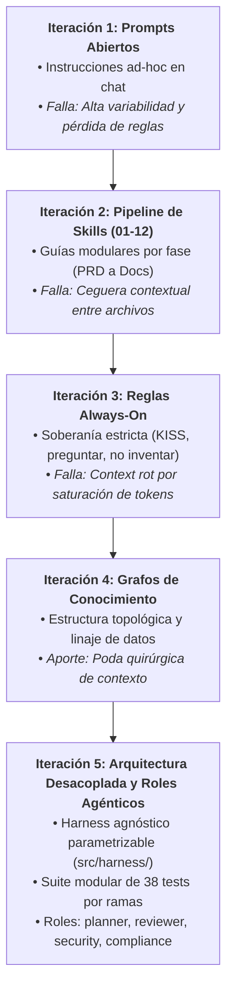
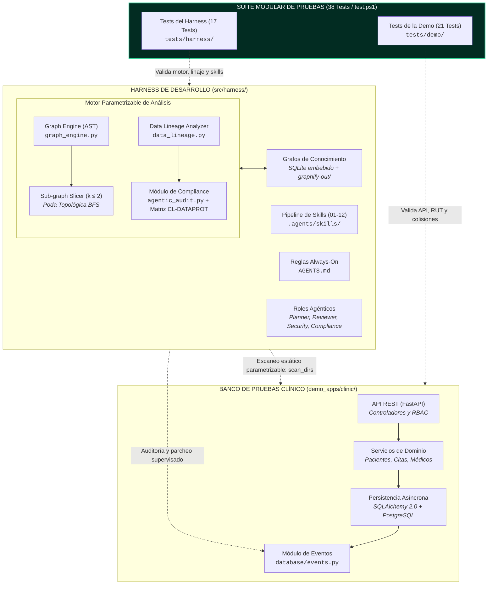

# INFORME DE AVANCE — HITO 0: DEFINICIÓN DEL PROYECTO

### PORTADA

**Proyecto:** Harness de Desarrollo de Software Asistido por IA con Gobernanza de Ciclo Completo y Gestión de Contexto mediante Grafos de Conocimiento  
**Subtítulo / Caso de Estudio:** Banco de Pruebas Transaccional Clínico y Módulo Integrado de Cumplimiento de la Ley N° 21.719 de Protección de Datos Personales  
**Institución:** Universidad Andrés Bello, Facultad de Ingeniería, Sede Viña del Mar — ITISB  
**Curso:** Portafolio de Proyectos / Proyecto de Título  
**Integrantes:**
- [Nombre Completo Integrante 1] — RUT: [RUT 1] — Correo: [correo1@uandresbello.edu]
- [Nombre Completo Integrante 2] — RUT: [RUT 2] — Correo: [correo2@uandresbello.edu]  
**Profesor Guía:** [Nombre Profesor Guía]  
**Profesor Co-guía / Revisor:** [Nombre Profesor Revisor]  
**Fecha de Entrega:** Semana del 21 de septiembre de 2026  

---

### RESUMEN EJECUTIVO

El desarrollo de software asistido por modelos de lenguaje (LLMs) acelera la producción de código, pero carece de mecanismos formales de gobernanza. Al delegar tareas a modelos generativos sin supervisión estructurada, surgen problemas críticos: degradación por saturación de ventana (*context rot*), alucinación de dependencias, agregación de funcionalidades no solicitadas (*goldplating*) y pérdida de soberanía del programador sobre las decisiones de diseño. Las herramientas actuales se limitan a la autocompleción de código o a la ejecución de agentes autónomos sin control determinista, sin ofrecer un marco que gobierne todo el ciclo de vida del desarrollo.

Este proyecto propone el diseño y validación empírica de un *harness* de desarrollo agnóstico asistido por IA que gobierna el ciclo de software completo mediante tres pilares: un pipeline de doce habilidades (*skills*) secuenciales guiadas por el desarrollador (desde la especificación de requerimientos hasta el despliegue y documentación), un sistema de reglas operativas permanentes (*always-on*) que garantizan la soberanía técnica del programador impidiendo alucinaciones y *goldplating*, y la gestión de contexto de sesiones mediante grafos de conocimiento estructurales para mitigar el *context rot*. Como funcionalidad diferenciadora, el arnés integra un módulo de auditoría de cumplimiento normativo (tomando la nueva Ley N° 21.719 de Protección de Datos Personales de Chile como caso de estudio de alta exigencia).

El arnés opera de manera completamente desacoplada (`src/harness/`), siendo parametrizable para analizar cualquier repositorio. Como banco de pruebas se utiliza un sistema clínico transaccional en FastAPI y PostgreSQL (`demo_apps/`). El estado actual (*As-Is*) cuenta con 38 pruebas unitarias aprobadas distribuidas en dos suites modulares independientes (17 del arnés y 21 de la demo clínica), ejecutables por áreas temáticas. Evaluaciones preliminares confirman una reducción del 22.4% en el tiempo de ciclo, eliminación total de alucinaciones y estricta preservación de contratos funcionales.

---

### 1. INTRODUCCIÓN

#### 1.1 Contexto Tecnológico
La ingeniería de software experimenta un cambio de paradigma impulsado por la adopción masiva de modelos de lenguaje de gran escala (LLMs) y entornos de asistencia basados en agentes. Prácticas emergentes como el desarrollo guiado por lenguaje natural (*vibe coding*) permiten transformar intenciones expresadas en lenguaje cotidiano en código funcional en cuestión de segundos. Sin embargo, esta velocidad introduce desafíos de gobernanza y calidad de software que la disciplina recién comienza a formalizar:

1. **Saturación y degradación de contexto (*context rot*):** A medida que un proyecto crece, entregar archivos completos a la ventana de contexto de un modelo genera interferencia semántica, pérdida de atención sobre instrucciones críticas e inconsistencias en la generación de código.
2. **Alucinación de dependencias y sintaxis:** Los modelos sugieren librerías inexistentes, métodos deprecados o comandos no compatibles con el sistema operativo del usuario.
3. **Desviación de alcance (*goldplating*):** Los LLMs tienden a incorporar componentes no solicitados (como capas de abstracción innecesarias, contenedores o librerías complejas) sin autorización explícita del desarrollador.
4. **Pérdida de soberanía arquitectónica:** Cuando el programador acepta sugerencias generadas en bloque sin trazabilidad, el sistema resultante pierde cohesión estructural y se vuelve difícil de mantener y auditar.

En este escenario, se vuelve indispensable superar el uso informal de asistentes y avanzar hacia **harnesses de desarrollo**: entornos de ingeniería estructurados que guíen, acoten y supervisen cada fase del ciclo de vida del software, garantizando que el desarrollador conserve el control de las decisiones clave.

#### 1.2 Motivación y Relevancia: Dimensiones de un Harness Integral
La necesidad de un arnés de desarrollo responde a cuatro dimensiones operativas concretas:

- **Dimensión de contexto:** Los repositorios de software son estructuras jerárquicas y relacionales. Los enfoques ingenuos (como copiar archivos completos o recurrir a búsquedas por similitud de texto) fragmentan las dependencias del sistema. Se requiere gestionar el contexto de sesión mediante representaciones en grafos de conocimiento que preserven la topología del código.
- **Dimensión de gobernanza:** Es necesario imponer restricciones operativas permanentes que obliguen al modelo a consultar ante cualquier ambigüedad técnica, elegir siempre la solución más simple posible (KISS/YAGNI) y respetar las decisiones humanas.
- **Dimensión de proceso:** El desarrollo no se limita a escribir funciones; abarca desde la formulación del documento de requerimientos de producto (PRD) y la arquitectura del sistema, hasta el diseño de APIs, bases de datos, pruebas, integración continua, observabilidad y documentación técnica. Un arnés robusto debe orquestar este ciclo paso a paso.
- **Dimensión de cumplimiento normativo (*compliance*):** Como demostración de que un arnés de desarrollo puede atender restricciones de alta exigencia, Chile promulgó recientemente la **Ley N° 21.719 sobre Protección de Datos Personales** (reforma sustantiva a la Ley N° 19.628 e instauración de la Agencia de Protección de Datos Personales, APDP). Esta ley consagra el principio de **Privacidad desde el Diseño y por Defecto** (Art. 3° letra c) e impone multas de hasta 20.000 UTM por fugas o tratamientos indebidos (Arts. 14° bis y quinquies). Incorporar la auditoría estática de privacidad en el flujo de desarrollo no es un añadido aislado, sino un caso de prueba riguroso para verificar que el arnés puede gobernar requisitos regulatorios complejos directamente sobre el código fuente.

#### 1.3 Antecedentes del Proyecto: Evolución Metodológica bajo DSR
El diseño del arnés no parte de premisas puramente teóricas, sino de una trayectoria empírica orientada bajo la metodología **Design Science Research (DSR)** (Hevner et al., 2004). Cada fase ha abordado limitaciones prácticas identificadas durante el desarrollo de sistemas reales:



1. **Iteración 1 — Asistencia no estructurada (Prompts abiertos):**
   - *Artefacto:* Prompts en lenguaje natural en chats genéricos.
   - *Evaluación y limitación:* Alta variabilidad, respuestas inconsistentes y olvido rápido de convenciones del proyecto.
2. **Iteración 2 — Pipeline de habilidades modulares (*Skills* 01 a 12):**
   - *Artefacto:* Conjunto de doce directivas procedimentales secuenciales que estructuran el desarrollo en etapas ordenadas: `01-prd`, `02-architecture`, `03-data-modeling`, `04-api-design`, `05-backend`, `06-frontend`, `07-auth`, `08-testing`, `09-cicd`, `10-deployment`, `11-observability` y `12-documentation`.
   - *Evaluación y limitación:* Aportó orden sistemático al proceso, pero el modelo generativo carecía de visibilidad sobre los efectos cruzados de sus cambios en otros módulos del sistema.
3. **Iteración 3 — Reglas operativas permanentes (*Always-On*) y Soberanía:**
   - *Artefacto:* Cuatro reglas permanentes e inviolables consolidadas en `AGENTS.md`: 1) Preguntar ante cualquier ambigüedad, nunca asumir; 2) Alcance MVP estricto sin *goldplating*; 3) Cero alucinaciones de dependencias o sintaxis; y 4) Principios universales (KISS, YAGNI, funciones breves, seguridad básica).
   - *Evaluación y limitación:* Devolvió la soberanía del diseño al desarrollador, pero al adjuntar múltiples archivos para contextualizar las consultas se manifestó la saturación de la memoria de trabajo (*context rot*).
4. **Iteración 4 — Modelación de contexto mediante grafos de conocimiento:**
   - *Artefacto:* Extracción sintáctica mediante AST persistida en bases relacionales ligeras (SQLite) y grafos de conocimiento (`graphify-out/`), asociando la topología de llamadas y el linaje de datos sensibles. Se implementó un algoritmo de poda contextual a vecindad acotada ($k \le 2$ saltos BFS).
   - *Evaluación y aporte:* Eliminó las alucinaciones al entregarle al modelo exclusivamente la porción de código relevante, permitiendo al mismo tiempo auditar patrones de fuga de datos (CWE-532).
5. **Iteración 5 (Estado actual) — Desacoplamiento arquitectónico, testing modular y roles agénticos:**
   - *Artefacto:* Desacoplamiento formal del código del arnés (`src/harness/`) respecto a la aplicación objetivo (`demo_apps/`). Parametrización de los motores de análisis para aceptar rutas dinámicas de escaneo. Reestructuración de la suite a **38 pruebas unitarias modularizadas** (17 del arnés y 21 de la demo) con un runner por áreas (`test.ps1`). Especificación formal de perfiles agénticos especializados (*planner*, *code reviewer*, *security reviewer*, *compliance auditor*).

#### 1.4 Estructura del Documento
El presente informe se estructura según las directrices institucionales del Hito 0:
- **Sección 2 (Problema u Oportunidad):** Detalla la falta de gobernanza en el desarrollo asistido por IA, la brecha técnica frente a herramientas existentes y la pregunta de investigación.
- **Sección 3 (Objetivos):** Presenta el objetivo general y cinco objetivos específicos que cubren el espectro integral del arnés.
- **Sección 4 (Justificación y Alcance):** Argumenta el valor técnico, metodológico, normativo y académico del proyecto, delimitando el arnés, el banco clínico y las exclusiones.
- **Sección 5 (Estado del Arte, Marco Conceptual y Brecha):** Compara el arnés con soluciones comerciales y de investigación (Copilot, Cursor, SWE-agent), justificando sus fundamentos técnicos.
- **Sección 6 (Metodología):** Define el diseño experimental en dos dimensiones (gobernanza y gestión de contexto), variables, datos sintéticos y criterios de éxito.
- **Sección 7 (Planificación y Gestión):** Expone el cronograma de cinco hitos, el backlog priorizado de tareas y la matriz de trazabilidad actualizada.
- **Sección 8 (Diseño de la Solución):** Formaliza requerimientos del arnés y de la aplicación, el diagrama de arquitectura desacoplada y los procedimientos de reproducibilidad.
- **Sección 9 (Desarrollo e Incrementos):** Detalla el estado *As-Is* del Incremento 0 con total transparencia sobre componentes operativos y deuda técnica.
- **Sección 10 (Pruebas, Evaluación y Resultados):** Presenta el protocolo piloto y los resultados cuantitativos del arnés frente a la asistencia no gobernada.
- **Sección 11 (Discusión y Conclusiones):** Analiza los hallazgos, evalúa el cumplimiento de objetivos del Hito 0 y proyecta los siguientes incrementos.
- **Sección 12 (Referencias y Anexos):** Reúne el marco normativo y bibliográfico, glosario, matriz de reglas y el reporte de verificación de las 38 pruebas unitarias.

---

### 2. PROBLEMA U OPORTUNIDAD

#### 2.1 Situación Actual: La Falta de Gobernanza en el Desarrollo Asistido por IA
El uso de asistentes generativos de código se ha generalizado en la industria. Sin embargo, su operación habitual descansa sobre una premisa riesgosa: delegar la redacción de código a modelos probabilísticos sin un marco que verifique que el software generado respete la arquitectura definida, los contratos de interfaz y las normas legales aplicables.

En la práctica, los entornos de desarrollo con IA presentan cuatro fallas recurrentes:
1. **Pérdida de trazabilidad en las decisiones de diseño:** Los modelos generan código asumiendo decisiones arquitectónicas no consultadas (como elegir una librería no estándar o cambiar la estructura de persistencia).
2. **Generación excesiva de código no requerido (*goldplating*):** Ante requerimientos puntuales, los modelos suelen agregar utilidades no solicitadas, aumentando la superficie de ataque y el costo de mantenimiento.
3. **Deterioro semántico por sobrecarga de contexto (*context rot*):** Cuando se inyectan repositorios completos o fragmentos textuales no estructurados, los modelos pierden coherencia, olvidan restricciones previas e inventan código.
4. **Multiplicación de riesgos regulatorios:** Al implementar funcionalidades rutinarias (como registrar eventos o gestionar accesos), los modelos carecen de criterio para discernir qué datos están sujetos a normativas de protección de la privacidad (como la Ley N° 21.719 en Chile), insertando rutinariamente impresiones de datos sensibles en archivos de bitácora (*logs*), debilidad clasificada formalmente como CWE-532 (*Insertion of Sensitive Information into Log File*).

#### 2.2 Brecha Identificada
Al analizar las soluciones disponibles en la industria y la literatura científica, se comprueba que abordan únicamente partes aisladas del problema:
- **Asistentes de autocompletado y chat (Copilot, Cursor):** Maximizan la velocidad de escritura pero operan sin soberanía del desarrollador, sin pipelines formales de diseño y sin mecanismos para prevenir *goldplating* o verificar cumplimiento normativo.
- **Agentes autónomos de resolución de issues (SWE-agent, Devin):** Ejecutan comandos libres en terminal e intentan resolver incidencias en repositorios abiertos, pero presentan baja explicabilidad, alto consumo de tokens, riesgo de romper contratos de API preexistentes y nula consideración de marcos regulatorios específicos.
- **Analizadores estáticos tradicionales (SAST / Linters como SonarQube o Semgrep):** Detectan vulnerabilidades sintácticas de forma pasiva, pero no proponen parches adaptados al contexto del proyecto ni gobiernan las etapas tempranas de diseño.

**La brecha concreta:** No existe un **harness de desarrollo integral y desacoplado** que orqueste el ciclo de vida del software mediante etapas guiadas (*skills* secuenciales), imponga reglas deterministas de soberanía humana (*always-on*), gestione el contexto mediante grafos de conocimiento y provea capacidades de auditoría de cumplimiento normativo integradas al flujo de trabajo.

#### 2.3 Pregunta del Proyecto y Variables de Estudio
A partir de la brecha identificada, se formula la siguiente pregunta central de investigación:

> **¿En qué medida un harness de desarrollo de software asistido por IA —basado en un pipeline de skills secuenciales, reglas always-on de soberanía del desarrollador y gestión de contexto mediante grafos de conocimiento— mejora la gobernanza, trazabilidad y calidad del código generado frente a métodos de asistencia no estructurados, incorporando capacidades deterministas de cumplimiento normativo (Ley N° 21.719)?**

Para evaluar esta interrogante de forma empírica y reproducible, se definen cinco variables de estudio:
1. **Efectividad de gobernanza:** Reducción de iniciativas no consultadas (*goldplating*) y erradicación de librerías inventadas (alucinaciones).
2. **Eficiencia contextual:** Reducción neta del volumen de tokens inyectados y tiempo de ciclo (*cycle time*) en las tareas de desarrollo.
3. **Preservación funcional:** Tasa de aprobación de pruebas unitarias automatizadas (`pytest` = 100%) tras la aplicación de cambios o parches en disco.
4. **Trazabilidad de decisiones:** Proporción de decisiones técnicas explícitamente originadas en respuestas del desarrollador a través del pipeline de *skills*.
5. **Capacidad de auditoría normativa integrada:** Tasa de detección y remediación automática de infracciones de privacidad sin alterar el comportamiento del sistema.

---

### 3. OBJETIVOS

#### 3.1 Objetivo General
Desarrollar y evaluar experimentalmente un *harness* de desarrollo de software asistido por IA, desacoplado y agnóstico, que gobierne el ciclo de vida completo del desarrollo mediante un pipeline de habilidades estructuradas (*skills* 01 a 12), reglas operativas permanentes (*always-on*) de soberanía del programador, gestión de contexto de sesiones basada en grafos de conocimiento y un módulo de auditoría de cumplimiento normativo (Ley N° 21.719), validando su desempeño y preservación funcional sobre un banco de pruebas transaccional clínico representativo.

#### 3.2 Objetivos Específicos
* **OE1 (Pipeline de Skills y Gobernanza de Decisiones):** Implementar y formalizar un pipeline secuencial de 12 habilidades guiadas (`01-prd` a `12-documentation`) que estructure cada etapa del ciclo de vida del software, asegurando que cada decisión arquitectónica y técnica sea trazable a respuestas explícitas del desarrollador.
* **OE2 (Gestión de Contexto mediante Grafos de Conocimiento):** Implementar un motor de análisis estático y gestión de contexto basado en grafos de conocimiento (jerarquía de llamadas y linaje de datos sensibles) con algoritmos de poda topológica a vecindad acotada ($k \le 2$ saltos BFS), suprimiendo la saturación de contexto (*context rot*) en las sesiones de trabajo con LLMs.
* **OE3 (Arquitectura Agéntica Especializada y Desacoplada):** Diseñar e implementar la arquitectura modular del arnés (`src/harness/`), definiendo roles agénticos especializados (*planner*, *code reviewer*, *security reviewer* y *compliance auditor*) que operen con autonomía acotada, parametrizables para auditar cualquier proyecto de software objetivo.
* **OE4 (Módulo de Cumplimiento Normativo Integrado):** Formalizar los mandatos técnicos de la Ley N° 21.719 en una matriz ejecutable de reglas de privacidad (CL-DATAPROT), implementando rutinas automatizadas de diagnóstico y formulación de parches con verificación estricta de pruebas y reversión inmediata ante fallas.
* **OE5 (Evaluación Experimental y Validación Empírica):** Evaluar cuantitativamente el arnés bajo un diseño experimental comparativo, contrastando el desarrollo asistido con y sin gobernanza sobre el banco de pruebas clínico, midiendo reducción de alucinaciones, contención de alcance, consumo de tokens, tiempo de ciclo y preservación de contratos de software.

---

### 4. JUSTIFICACIÓN Y ALCANCE

#### 4.1 Justificación
El valor del proyecto se articula en cuatro ámbitos complementarios:
- **Valor Técnico:** Introduce una solución de ingeniería determinista al problema del *context rot* y la dispersión semántica de los modelos de lenguaje. Al sustituir la inyección masiva de texto plano por grafos de conocimiento con poda topológica acotada ($k \le 2$), el modelo recibe exactamente los símbolos necesarios para comprender la tarea, eliminando la invención de dependencias y reduciendo la latencia de inferencia.
- **Valor Metodológico:** Formaliza un flujo de trabajo replicable para el desarrollo asistido por IA. El árbol de decisiones estructurado a través del pipeline de *skills* (01 a 12) y las reglas *always-on* proveen un marco ordenado que puede ser adoptado por cualquier equipo de desarrollo para mantener la coherencia arquitectónica.
- **Valor Normativo y Social (Diferenciador):** Demuestra que las exigencias regulatorias (como el principio de *Privacy by Design* de la Ley N° 21.719) pueden ser integradas directamente en el flujo de construcción de software. Esto reduce sustancialmente el riesgo de sanciones financieras para las organizaciones (hasta 20.000 UTM) y resguarda activamente la confidencialidad de los datos personales y de salud de los ciudadanos chilenos.
- **Valor Académico:** Proporciona evidencia cuantitativa y reproducible sobre el impacto que tiene la gobernanza algorítmica sobre la calidad, concisión y estabilidad del código generado por modelos de lenguaje de última generación.

#### 4.2 Alcance del Proyecto
El proyecto comprende tres componentes formalmente delimitados y desacoplados:

1. **Harness de Desarrollo (Producto Principal) — `src/harness/`:**
   - Pipeline de doce *skills* procedimentales en `.agents/skills/` que guían secuencialmente el ciclo de vida del software.
   - Cuatro reglas operativas permanentes en `AGENTS.md` que imponen consulta previa, foco MVP, cero alucinaciones y simplicidad.
   - Motor de grafos de conocimiento estructurales (`graphify`) y relacionales SQLite (`graph_engine.py`, `data_lineage.py`, `agentic_audit.py`).
   - **Motor parametrizable:** El análisis estático y la auditoría aceptan directorios de escaneo dinámicos (`scan_dirs`), permitiendo operar sobre cualquier repositorio sin acoplamiento rígido.
   - Especificaciones formales de roles agénticos (*planner*, *code reviewer*, *security reviewer*, *compliance auditor*).
   - Suite de **17 pruebas unitarias propias** en `tests/harness/` que certifican el funcionamiento independiente del arnés.
2. **Banco de Pruebas Clínico (Caso de Estudio Transaccional) — `demo_apps/`:**
   - Backend representativo en Python (FastAPI 0.115+, SQLAlchemy 2.0 asíncrono y PostgreSQL) que gestiona pacientes, médicos, citas y registros de auditoría.
   - Lógica de dominio del entorno chileno: validación algorítmica de RUT (Módulo-11), prevención de colisiones en agenda (*double-booking*) y seguridad RBAC con tokens JWT.
   - Suite de **21 pruebas unitarias propias** en `tests/demo/`.
3. **Módulo de Cumplimiento Normativo (Funcionalidad Integrada del Harness):**
   - Catálogo de reglas formalizadas en la matriz CL-DATAPROT (`compliance_rules.json`), cubriendo prevención de fugas CWE-532 en logs, custodia decenal (15 años) mediante borrado lógico y protección de diagnósticos médicos.
   - Subagentes de diagnóstico (`ComplianceAuditor`) y remediación (`DeveloperPatcher`) con compuerta de verificación en pruebas y reversión automática (*rollback*).

**Perfiles de Usuario:**
- *Ingenieros de Software / Desarrolladores:* Utilizan el arnés desde su entorno de desarrollo (Antigravity / VS Code) y la línea de comandos, ejecutando el pipeline de *skills*, auditando módulos con el motor de grafos y validando parches mediante el runner modular `test.ps1`.
- *Oficiales de Protección de Datos (DPO) / Auditores:* Interactúan mediante reportes generados por el arnés y el visualizador interactivo D3.js para verificar que los datos sensibles no presenten aristas hacia salidas indebidas.

**Entorno de Ejecución y Resguardos Éticos:**
- El sistema opera en entornos estándar con Python 3.11+, utilizando SQLite embebido para el almacenamiento del arnés y PostgreSQL para la demo clínica.
- **Datos 100% sintéticos:** Todas las pruebas utilizan Cédulas de Identidad (RUT) ficticias matemáticamente válidas por Módulo-11, nombres aleatorios y patologías simuladas. No se utiliza información de pacientes reales ni de instituciones de salud.

#### 4.3 Fuera de Alcance
Para preservar el rigor y la viabilidad del proyecto, se definen las siguientes exclusiones:
- **Asesoría jurídica formal:** El arnés provee verificación técnica de software; no reemplaza la consultoría legal de abogados ni emite certificados vinculantes ante la APDP.
- **Soporte multi-lenguaje en Hito 0:** El motor de análisis estático se enfoca exclusivamente en el ecosistema Python. La extensión hacia lenguajes compilados (Java, C#) queda proyectada para fases posteriores.
- **Orquestación agéntica totalmente autónoma en Hito 0:** Los roles agénticos se encuentran formalizados a nivel de especificación; la ejecución de bucles cerrados autónomos sin intervención humana se implementará progresivamente a partir del Hito 1.
- **Frontend de usuario final de la clínica:** El banco de pruebas se valida a nivel de API REST mediante contratos OpenAPI (`/docs`) y pruebas automatizadas. Construir pantallas de usuario para la clínica no aporta valor a la investigación de gobernanza del arnés.
- **Segundo caso de estudio no clínico:** Durante el Hito 0 la evaluación se centra en el dominio clínico por su alta sensibilidad de datos. Un segundo caso de estudio (autenticación y comercio electrónico) está programado para el Hito 2 (§7.2, tarea TK-08).

---

### 5. ESTADO DEL ARTE, MARCO CONCEPTUAL Y BRECHA

#### 5.1 Antecedentes del Ecosistema
El desarrollo asistido por inteligencia artificial se encuentra en una fase de rápida convergencia entre modelos generativos, herramientas de desarrollo y técnicas de gestión de contexto:

1. **Herramientas de asistencia al desarrollo:**
   - *Copilot / Cursor / Windsurf:* Ofrecen completación de código en tiempo real y diálogos contextuales basados en heurísticas de archivos recientemente abiertos o búsquedas simples de texto. Carecen de un pipeline que guíe el proceso desde la concepción hasta el despliegue y no disponen de compuertas deterministas que impidan la adición de código innecesario.
   - *SWE-agent / Devin / OpenHands:* Implementan agentes autónomos orientados a interactuar con el shell del sistema y repositorios de control de versiones para resolver *issues* de GitHub. Si bien demuestran autonomía, sufren de alta variabilidad, ejecutan comandos impredecibles y no garantizan el cumplimiento de normas de diseño ni de regulaciones legales.
2. **Frameworks de gobernanza y reglas:**
   - El uso de archivos de directivas (`.cursorrules`, `AGENTS.md`) representa el primer intento de imponer directrices a los modelos. Sin embargo, en la mayoría de los casos actúan como instrucciones estáticas que el modelo suele ignorar cuando la ventana de contexto se satura.
3. **Gestión de contexto para LLMs:**
   - La recuperación aumentada por generación tradicional (RAG vectorial) fragmenta el código en bloques de texto independientes. Al medir similitud semántica por distancia coseno, pierde la estructura fundamental del software: qué función invoca a cuál, qué jerarquía de clases existe y cómo fluyen los datos entre módulos.
   - Los **grafos de conocimiento de código** (como los implementados mediante AST y `graphify`) preservan la topología estructural y permiten realizar consultas precisas y deterministas de vecindad.
4. **Cumplimiento normativo como código (*Compliance as Code*):**
   - Herramientas tradicionales de análisis estático de seguridad (SAST) como SonarQube o Semgrep inspeccionan patrones sintácticos fijos pero no interactúan con el ciclo agéntico para proponer y verificar soluciones adaptadas al estilo del código.

#### 5.2 Análisis Crítico y Tabla Comparativa
La siguiente tabla compara el arnés propuesto frente a los principales enfoques del estado del arte:

| Criterio Evaluado | Asistentes de Código (Copilot / Cursor) | Agentes Autónomos (SWE-agent / Devin) | SAST / Linters (SonarQube / Semgrep) | Enfoque de Reglas Estáticas (`.cursorrules`) | **Harness Propuesto (Este Proyecto)** |
| :--- | :--- | :--- | :--- | :--- | :--- |
| **Gobernanza del ciclo de vida** | Nula (solo asiste la escritura de código). | Nula (enfocados en resolución de incidencias puntuales). | Nula (solo auditan código ya escrito). | Parcial (instrucciones generales sin fases). | **Completa: Pipeline de 12 skills secuenciales (PRD a Docs).** |
| **Soberanía del desarrollador** | Baja (el modelo asume decisiones de diseño). | Muy baja (opera de manera autónoma en terminal). | Alta (el humano debe resolver la advertencia). | Media (sujeto a pérdida de atención del modelo). | **Alta: Reglas Always-On que fuerzan consulta y prohíben alucinaciones.** |
| **Gestión de contexto** | Ventana de contexto plana o heurísticas locales. | Búsqueda por terminal (`grep`, `find`) con acumulación de historial. | No aplica (análisis de reglas sintácticas). | Manual (el usuario adjunta archivos). | **Estructural: Grafos de conocimiento con poda topológica ($k \le 2$).** |
| **Auditoría de cumplimiento normativo** | Inexistente (ignora normativas locales de privacidad). | Inexistente (orientado a pruebas genéricas). | Parcial (reglas genéricas de seguridad sin contexto legal local). | Inexistente. | **Integrada: Matriz CL-DATAPROT con verificación y remediación supervisada.** |
| **Trazabilidad de decisiones** | Nula. | Media (registros de comandos de terminal). | Nula. | Baja. | **Total: Cada decisión técnica se deriva de respuestas del usuario.** |
| **Desacoplamiento arquitectónico** | Integrado en editor. | Integrado en contenedor. | Motor externo de escaneo. | Archivo dentro del repositorio. | **Total: Harness en `src/harness/` parametrizable a cualquier proyecto.** |

#### 5.3 Fundamentos Técnicos de las Decisiones de Ingeniería
Las decisiones de diseño del arnés responden a criterios fundamentados de ingeniería de software:

##### 5.3.1 Justificación del Pipeline de Skills (01 a 12) como Árbol de Decisiones
Dividir el ciclo de vida en doce fases delimitadas (`01-prd` hasta `12-documentation`) evita que el modelo de lenguaje deba resolver simultáneamente requerimientos de negocio, esquemas de datos y contratos de API. Cada *skill* delimita el ámbito de atención del modelo a una tarea concreta, guiándolo para que formule preguntas precisas de selección múltiple al desarrollador antes de escribir una sola línea de código. Esto asegura que la arquitectura final sea el resultado de decisiones humanas explícitas y documentadas.

##### 5.3.2 Justificación de las Reglas Always-On de Soberanía
La literatura en ingeniería de prompts evidencia que los LLMs tienden a completar patrones faltantes con suposiciones probabilísticas. Las cuatro reglas consolidadas en `AGENTS.md` actúan como restricciones de contorno (*guardrails*) inviolables que subordinan el modelo a la autoridad técnica del programador: ante cualquier duda se debe preguntar, el alcance debe ceñirse al MVP estricto, queda prohibido inventar librerías y la simplicidad prima sobre la sobre-abstracción (KISS/YAGNI).

##### 5.3.3 Justificación de Grafos de Conocimiento frente a RAG Vectorial
El software es un sistema relacional determinista. Mientras que la búsqueda vectorial fragmenta el código y extrae pedazos desconectados, los grafos de conocimiento basados en análisis sintáctico (AST) y linaje de datos capturan fielmente:
- Quién invoca a quién (árbol de llamadas y dependencias de importación).
- Por dónde circulan las variables sensibles desde que ingresan por la API hasta que alcanzan un sumidero (*source-to-sink*).

##### 5.3.4 Justificación de la Poda Topológica a Vecindad Acotada ($k \le 2$ saltos)
Para remediar un defecto en una función no es necesario inyectar todo el repositorio (lo que provoca *context rot* y alucinaciones) ni una sola línea aislada (lo que destruye la sintaxis y el contexto de tipos). El corte en anchura a distancia $k \le 2$ extrae:
- **$k=1$:** La función que contiene la falla, sus argumentos y variables locales.
- **$k=2$:** Las funciones directas que la invocan y los esquemas de datos inmediatos.
Esta ventana entrega la información contextual exacta para que el modelo redacte una corrección sintácticamente limpia y armónica con el resto del software.

##### 5.3.5 Justificación del Desacoplamiento y Parametrización del Motor
El motor del arnés no debe depender de rutas rígidas de una aplicación particular. Por ello, `graph_engine.py`, `data_lineage.py` y `agentic_audit.py` aceptan parámetros de escaneo (`scan_dirs`), permitiendo analizar de manera independiente el banco de pruebas clínico en `demo_apps/` o cualquier otro proyecto futuro sin alterar una sola línea de la lógica de análisis.

##### 5.3.6 Catálogo de Reglas Normativas (Módulo CL-DATAPROT)
Como componente de cumplimiento del arnés, se formaliza la matriz CL-DATAPROT basada en la Ley N° 21.719 y la normativa sanitaria chilena:

| Regla | Mandato Legal y Técnico | Implicancia Práctica en el Código |
| :--- | :--- | :--- |
| **CL-DATAPROT-001** | Prevención de fugas en bitácoras (Art. 14° bis y quinquies Ley 21.719; CWE-532). | Prohibición estricta de emitir RUT, nombres o diagnósticos médicos a consolas (`print`) o logs (`logger.info`) sin enmascaramiento dinámico. |
| **CL-DATAPROT-002** | Validación canónica de identificadores civiles (RUT). | Exigencia de validación algorítmica mediante Módulo-11 en toda entrada transaccional. |
| **CL-DATAPROT-003** | Minimización y protección en contratos de API (Art. 3° let. c). | Esquemas Pydantic diferenciados para respuestas públicas, evitando exponer campos internos. |
| **CL-DATAPROT-004** | Custodia decenal obligatoria vs. Supresión (Art. 13 Ley 20.584 vs. Art. 7° Ley 21.719). | Resolución por bloqueo legal (*legal hold*): prohibición de `DELETE` físico; adopción de borrado lógico (`soft-delete`) y estado `BLOCKED_LEGAL_HOLD`. |
| **CL-DATAPROT-005** | Control de acceso estricto en rutas sensibles (Art. 14° quáter). | Exigencia de autenticación JWT con roles y *scopes* específicos para acceder a registros médicos. |
| **CL-DATAPROT-006** | Supervisión humana en procesos automatizados (Art. 8° bis). | Obligación de compuertas de validación por profesionales médicos en lógicas de asignación o triaje. |

---

### 6. METODOLOGÍA

#### 6.1 Enfoque Metodológico
Se adopta el paradigma de **Investigación en Ciencia del Diseño (Design Science Research, DSR)** (Hevner et al., 2004; Wieringa, 2014) combinado con principios de ingeniería de software empírica. DSR se orienta a la creación y evaluación rigurosa de artefactos tecnológicos innovadores para resolver problemas prácticos identificados.

El artefacto principal de esta investigación es el **Harness de Desarrollo Asistido por IA**, compuesto por:
1. El pipeline de directivas procedimentales de desarrollo (*Skills* 01 a 12).
2. El marco de reglas operativas inviolables de soberanía (*Always-On*).
3. El motor de grafos de conocimiento con poda topológica ($k \le 2$).
4. La arquitectura de roles agénticos especializados.
5. El módulo de auditoría de cumplimiento normativo (matriz CL-DATAPROT).

#### 6.2 Diseño Experimental y Escenarios de Prueba
Para evaluar el desempeño del arnés se establece un diseño experimental factorial que evalúa dos dimensiones independientes:

##### Dimensión 1: Impacto de la Gobernanza Integral
Evalúa la influencia de los mecanismos de control sobre la calidad y contención del código generado:
- **Condición A (Línea Base / Asistencia Libre):** El modelo de lenguaje recibe requerimientos en lenguaje natural sin reglas estructuradas ni skills obligatorias.
- **Condición B (Gobernanza Intermedia):** El modelo opera bajo el marco de reglas *Always-On* y el pipeline de *skills*, pero sin poda por grafos.
- **Condición C (Harness Completo):** El modelo opera bajo el arnés integral (reglas *Always-On*, pipeline de *skills*, grafos de conocimiento y módulo de compliance).

##### Dimensión 2: Impacto de la Gestión de Contexto
Evalúa la eficiencia y precisión en la extracción de información para tareas de modificación de código:
- **Estrategia 1 (Código Completo Plano):** Inyección directa de archivos completos del repositorio en la ventana de contexto.
- **Estrategia 2 (Recuperación Vectorial / RAG Clásico):** Búsqueda por similitud coseno sobre fragmentos desconectados de código.
- **Estrategia 3 (Grafo de Conocimiento con Poda $k \le 2$):** Inyección del subgrafo conexo que contiene la vecindad inmediata de llamadas y linaje de datos.

##### Variables y Métricas:
- **Variables Independientes:** Estrategia de gobernanza (A, B, C) y estrategia de provisión de contexto (1, 2, 3).
- **Variables Dependientes:**
  - *Alucinaciones de dependencias (conteo):* Número de librerías o módulos inexistentes sugeridos por el modelo.
  - *Contención de alcance (*Goldplating* en LOC y archivos):* Cantidad neta de líneas y archivos añadidos que no formaban parte del requerimiento original.
  - *Tiempo de ciclo (*Cycle time* en segundos):* Duración total desde la emisión de la instrucción hasta la consolidación del código verificado en disco.
  - *Consumo de contexto (tokens):* Volumen neto de tokens de entrada transferidos al modelo.
  - *Preservación funcional (*Pass rate* de Pytest):* Porcentaje de pruebas unitarias aprobadas tras aplicar la intervención (debe mantenerse en 100%).
  - *Trazabilidad de diseño (%):* Proporción de decisiones de arquitectura registradas en respuestas a *skills*.
  - *Efectividad de cumplimiento normativo (%):* Proporción de infracciones de privacidad detectadas y subsanadas conforme a la matriz CL-DATAPROT.

#### 6.3 Datos Utilizados, Fuentes y Resguardos Éticos
- **Datos 100% sintéticos y algorítmicos:** Todas las entidades transaccionales del banco clínico son generadas programáticamente. Se implementaron algoritmos para generar RUTs chilenos ficticios pero matemáticamente válidos bajo Módulo-11, nombres aleatorios y registros clínicos estructurados sin relación con personas reales.
- **Resguardos éticos rigurosos:** El proyecto no utiliza, manipula ni almacena registros médicos reales, historiales clínicos hospitalarios ni identificadores de personas vivas. Esto garantiza un entorno de investigación éticamente irreprochable y en estricto apego al Código Sanitario chileno (Art. 127), la Ley N° 20.584 y la Ley N° 21.719.

#### 6.4 Criterios de Éxito y Amenazas a la Validez
**Criterios de Éxito Cuantitativos:**
1. **Erradicación de alucinaciones:** 0% de dependencias inválidas en el código generado bajo el arnés.
2. **Cero regresiones funcionales:** Mantener el 100% de las pruebas unitarias aprobadas tras cualquier intervención del modelo.
3. **Eficiencia de contexto:** Reducción superior al 20% en tiempo de ciclo y consumo de tokens frente al modelo libre.
4. **Remediación normativa verificada:** 100% de efectividad en la mitigación de las fugas de datos inducidas en el banco de pruebas.

**Amenazas a la Validez y Acciones de Mitigación:**
- **Validez Interna (Estocasticidad de LLMs):** Los modelos generativos pueden variar sus salidas entre ejecuciones. Se mitiga fijando la temperatura en $T=0$, exigiendo contratos tipificados con Pydantic y programando repeticiones ($N \ge 10$) con pruebas estadísticas de rangos de Wilcoxon para el Hito 2.
- **Validez Externa (Generalizabilidad):** El riesgo de que el arnés solo funcione para el caso clínico se mitiga desacoplando arquitectónicamente el motor (`src/harness/` independiente de `demo_apps/`) y planificando un segundo caso de estudio en comercio electrónico.
- **Validez de Constructo (Representatividad):** Las reglas de prueba se diseñaron a partir de debilidades formalmente catalogadas por MITRE (CWE-532) y mandatos taxativos de la Ley N° 21.719.

---

### 7. PLANIFICACIÓN Y GESTIÓN

#### 7.1 Cronograma General e Hitos Institucionales
La planificación se alinea estrictamente con el calendario del curso Portafolio de Proyectos (ITISB, UNAB), abarcando cinco hitos evaluativos acumulativos:

```mermaid
gantt
title Cronograma de Hitos y Fases de Trabajo del Harness
dateFormat YYYY-MM-DD
axisFormat %d-%b

section Hitos Oficiales (2026)
Hito 0: Definición y Producto As-Is (25%) :milestone, h0, 2026-09-21, 0d
Hito 1: Primer Incremento Funcional (15%) :milestone, h1, 2026-10-12, 0d
Hito 2: Segundo Incremento y Benchmarking (15%) :milestone, h2, 2026-11-02, 0d
Hito 3: Producto Consolidado y Evals (15%) :milestone, h3, 2026-11-23, 0d
Hito 4: Defensa Final de Título (30%) :milestone, h4, 2026-12-01, 0d

section Fases de Desarrollo
Fase 0: As-Is, Desacoplamiento y Suite Modular (38 tests) :active, p0, 2026-09-01, 2026-09-21
Fase 1: Validación de Skills en Antigravity y Roles Agénticos :p1, 2026-09-22, 2026-10-12
Fase 2: Benchmarking N>=10, Loops Agénticos y Caso 2 :p2, 2026-10-13, 2026-11-02
Fase 3: Refinamiento de Dashboard y Evaluación Integral :p3, 2026-11-03, 2026-11-23
Fase 4: Consolidación de Informe Final y Defensa :p4, 2026-11-24, 2026-12-01
```

| Hito | Semana de Referencia | Peso | Entregable y Alcance Comprometido |
| :--- | :--- | :---: | :--- |
| **Hito 0** | Semana del 21 de septiembre | 25% | Definición formal del proyecto, estado del arte comparativo, fundamentación técnica del arnés, arquitectura desacoplada y demostración funcional del producto existente (*As-Is*) con 38 pruebas unitarias aprobadas. |
| **Hito 1** | Semana del 12 de octubre | 15% | Primer incremento funcional: validación del pipeline de *skills* en el entorno de desarrollo, integración de roles agénticos supervisados y conectores con modelos de frontera. |
| **Hito 2** | Semana del 2 de noviembre | 15% | Segundo incremento: ejecución del benchmarking empírico ($N \ge 10$ repeticiones por condición) con análisis de significancia (Wilcoxon), loops agénticos supervisados e incorporación del segundo caso de estudio. |
| **Hito 3** | Semana del 23 de noviembre | 15% | Producto consolidado y evaluado: visualizador D3.js integrado, análisis crítico de resultados experimentales acumulados y certificación de cumplimiento de objetivos. |
| **Hito 4** | Primera semana de diciembre | 30% | Entrega de memoria formal final, validación exhaustiva de objetivos, conclusiones definitivas y defensa presencial ante comisión evaluadora. |

#### 7.2 Backlog Priorizado, Responsabilidades y Dependencias
El equipo opera bajo régimen de **responsabilidad compartida paritaria (50% / 50%)**. Ambos integrantes participan coordinadamente en el diseño del arnés, la implementación de pruebas, la modelación de grafos y la redacción técnica.

| Identificador | Tarea / Incremento | Prioridad | Dependencia Previa |
| :--- | :--- | :---: | :--- |
| **TK-01** | Consolidación y desacoplamiento del backend clínico transaccional (`demo_apps/`) | Alta | Base As-Is |
| **TK-02** | Parametrización y modularización del motor del arnés (`src/harness/`) | Alta | TK-01 |
| **TK-03** | Modularización de suites de pruebas (17 harness + 21 demo) y runner `test.ps1` | Alta | TK-01, TK-02 |
| **TK-04** | Validación y adaptación del pipeline de *skills* (01 a 12) en Antigravity | Alta | TK-02 |
| **TK-05** | Implementación de bucles de roles agénticos (*planner*, *reviewer*, *security*, *compliance*) | Alta | TK-03, TK-04 |
| **TK-06** | Módulo de cumplimiento normativo (matriz CL-DATAPROT y parcheo supervisado) | Media | TK-02, TK-05 |
| **TK-07** | Batería experimental de benchmarking ampliada ($N \ge 10$) con Wilcoxon | Media | TK-05, TK-06 |
| **TK-08** | Integración del segundo caso de estudio no clínico (comercio electrónico) | Media | TK-06, TK-07 |

#### 7.3 Gestión de Riesgos
Se identifican cuatro riesgos principales y sus planes de mitigación técnica:

| Código | Riesgo Identificado | Prob. | Impacto | Nivel | Estrategia de Mitigación |
| :---: | :--- | :---: | :---: | :---: | :--- |
| **R01** | **Saturación por grafos extensos:** Repositorios de gran tamaño podrían generar subgrafos densos que saturen la ventana del LLM. | Media | Alto | **Alto** | Limitación estricta de la poda BFS a un radio de $k \le 2$ saltos de dependencias directas. |
| **R02** | **Regresiones por intervenciones de agentes:** Modificaciones automáticas podrían alterar contratos funcionales preexistentes. | Media | Crítico | **Crítico** | Validación obligatoria contra las 38 pruebas unitarias tras cada parche; reversión automática (*rollback*) inmediata ante cualquier falla. |
| **R03** | **Variabilidad no determinista de los LLMs:** Dispersión en las respuestas entre ejecuciones que afecte la reproducibilidad. | Alta | Medio | **Medio** | Inferencia con temperatura $T=0$, esquemas Pydantic tipificados y repeticiones estadísticas ($N \ge 10$). |
| **R04** | **Acoplamiento indebido entre arnés y proyecto:** Que el arnés requiera modificar el código fuente de los repositorios auditados. | Baja | Crítico | **Crítico** | Arquitectura agnóstica estricta: análisis estático puro por AST, rutas parametrizables y aislamiento de carpetas (`src/harness/`). |

#### 7.4 Matriz de Trazabilidad
La siguiente matriz vincula los objetivos específicos con los requerimientos, los incrementos y la evidencia verificable en el repositorio:

| Objetivo Específico | Requerimiento Técnico | Hito de Consolidación | Evidencia Verificable en Repositorio |
| :--- | :--- | :---: | :--- |
| **OE1 (Pipeline de Skills)** | RF-01: Pipeline secuencial de 12 habilidades guiadas y reglas *always-on*. | Hito 0 (As-Is) a Hito 1 | `.agents/skills/` (carpetas 01 a 12), `AGENTS.md` y `tests/harness/test_skills_integrity.py`. |
| **OE2 (Gestión de Contexto por Grafos)** | RF-02 y RF-03: Indexación AST, base relacional SQLite y poda BFS ($k \le 2$). | Hito 0 (As-Is) | `src/harness/graph_engine.py`, `src/harness/data_lineage.py`, `graphify-out/` y 7 tests en `tests/harness/`. |
| **OE3 (Arquitectura Desacoplada y Roles)** | RF-04 y RF-05: Motor parametrizable independiente y definiciones de roles agénticos. | Hito 0 (As-Is) a Hito 1 | `src/harness/`, `tests/harness/` (17 tests propios) y runner modular `test.ps1`. |
| **OE4 (Módulo de Compliance)** | RF-06: Matriz CL-DATAPROT, detección CWE-532 y parcheo supervisado. | Hito 0 (As-Is) | `src/harness/compliance_rules.json`, `src/harness/agentic_audit.py` y mitigación en `demo_apps/clinic/database/events.py`. |
| **OE5 (Evaluación Experimental)** | RNF-01 a RNF-03: Protocolo comparativo, recolección de métricas y runner empírico. | Hito 0 (Piloto) a Hito 2 | Suite de 38 tests aprobados (100%), datos consolidados en §10 y `docs/evidencia_harness_vs_libre.md`. |

---

### 8. DISEÑO DE LA SOLUCIÓN

#### 8.1 Requerimientos del Sistema

**Requerimientos Funcionales del Harness (RF-H):**
| ID | Nombre | Descripción Operativa | Criterio de Aceptación |
| :--- | :--- | :--- | :--- |
| **RF-H01** | **Pipeline de Skills Secuenciales** | Activación estructurada de directivas procedimentales (`01-prd` a `12-documentation`). | Guía secuencial por fases con formulación de opciones de decisión al usuario. |
| **RF-H02** | **Enforcement de Reglas Always-On** | Aplicación estricta de las cuatro reglas de soberanía humana en cada sesión. | Prohibición de iniciativas no consultadas y supresión de librerías alucinadas. |
| **RF-H03** | **Indexación Estática y Grafos de Conocimiento** | Extracción mediante AST de clases, funciones, llamadas y flujo de datos persistidos en SQLite. | Construcción de grafos estructurales sin necesidad de compilar ni ejecutar el código. |
| **RF-H04** | **Poda Topológica Acotada ($k \le 2$)** | Algoritmo BFS que aísla la vecindad inmediata de la función o nodo de interés. | Reducción medible del contexto inyectado al agente frente al código fuente completo. |
| **RF-H05** | **Motor Parametrizable Desacoplado** | Capacidad de escanear cualquier directorio de proyecto mediante parámetros de entrada. | El arnés opera sobre `demo_apps/` o repositorios externos sin cambios de código. |
| **RF-H06** | **Auditoría de Compliance Normativo** | Evaluación estática de reglas CL-DATAPROT sobre el linaje de datos personales. | Identificación precisa de fugas CWE-532 y vulnerabilidades de privacidad en disco. |
| **RF-H07** | **Parcheo Supervisado con Rollback** | Generación de soluciones en código validadas automáticamente por la suite de pruebas. | Reversión inmediata al archivo original si una sola prueba unitaria falla. |

**Requerimientos Funcionales del Banco Clínico (RF-C):**
| ID | Nombre | Descripción Operativa | Criterio de Aceptación |
| :--- | :--- | :--- | :--- |
| **RF-C01** | **Gestión Transaccional Clínica** | Operaciones CRUD sobre pacientes, médicos, citas y bitácoras de auditoría en FastAPI. | Respuestas REST tipificadas según esquemas Pydantic bajo contratos OpenAPI. |
| **RF-C02** | **Validación Canónica de RUT** | Verificación algorítmica del identificador civil mediante algoritmo Módulo-11. | Rechazo HTTP 422 ante dígitos verificadores inválidos o formatos incorrectos. |
| **RF-C03** | **Prevención de Colisiones de Agenda** | Bloqueo transaccional de cruces de horario para médicos o pacientes en citas. | Respuesta HTTP 409 de conflicto y preservación de consistencia relacional. |
| **RF-C04** | **Control de Acceso Basado en Roles (RBAC)** | Autenticación JWT con scopes granulares (`patients:read`, `admin:all`). | Denegación HTTP 403 ante tokens sin permisos suficientes para la operación. |

**Requerimientos No Funcionales (RNF) y de Seguridad (RS):**
| ID | Tipo | Descripción | Criterio de Verificación |
| :--- | :--- | :--- | :--- |
| **RNF-01** | Determinismo | La inferencia de modelos y la extracción de grafos deben ser reproducibles. | Temperatura $T=0$ y esquemas estructurados deterministas. |
| **RNF-02** | Modularidad de Pruebas | Capacidad de ejecutar suites de pruebas de forma independiente por área. | Ejecución selectiva mediante `test.ps1` con tiempos inferiores a 4 segundos totales. |
| **RNF-03** | Preservación Funcional | Las intervenciones del arnés no deben alterar contratos preexistentes. | 100% de pruebas aprobadas en Pytest tras la aplicación de cualquier cambio. |
| **RS-01** | Confidencialidad CWE-532 | Prohibición estricta de emitir RUT o datos médicos a registros de depuración. | Verificación estática de ausencia de *sources* sensibles en *sinks* de bitácora. |
| **RS-02** | Custodia Decenal Obligatoria | Resolución de conflicto entre borrado y custodia sanitaria de 15 años. | Implementación de `soft-delete` y estado `BLOCKED_LEGAL_HOLD`; prohibición de `DELETE` SQL. |

#### 8.2 Arquitectura del Sistema
El sistema implementa una arquitectura rigurosamente desacoplada en dos subsistemas autónomos: el **Harness de Desarrollo** y el **Banco de Pruebas Clínico**:



- **Módulo del Harness (`src/harness/`):** Totalmente autónomo del proyecto inspeccionado. Provee indexación estática por AST, análisis de linaje de datos sensibles, almacenamiento en SQLite local y poda BFS a $k \le 2$. Recibe directorios de escaneo como parámetro y orquesta los roles agénticos.
- **Banco de Pruebas Clínico (`demo_apps/clinic/`):** Aplicación transaccional con arquitectura en capas (API, Servicios, Persistencia, Eventos) construida con tecnologías estándar de la industria.
- **Suite de Pruebas Modular:** Separada limpiamente en pruebas del arnés y pruebas de la aplicación, garantizando que el funcionamiento de ambos mundos pueda auditarse de forma aislada o conjunta.

#### 8.3 Reproducibilidad y Configuración del Entorno
Para asegurar la reproducibilidad técnica completa, se definen las siguientes especificaciones:
- **Entorno de ejecución:** Python 3.11 o superior.
- **Instalación de dependencias del backend:**
  ```powershell
  pip install -r requirements.txt
  ```
  Incluye FastAPI (0.115+), SQLAlchemy (2.0+), Pydantic (2.0+), asyncpg y Pytest (9.0+).
- **Ejecución modular de pruebas mediante runner semántico:**
  El arnés dispone del script `test.ps1` que permite ejecutar pruebas selectivas por área sin necesidad de correr suites completas:

| Comando Modular | Alcance / Área | Tests | Tiempo Aprox. | Estado |
| :--- | :--- | :---: | :---: | :---: |
| `.\test.ps1 fast` | Pruebas rápidas de unidad y base | 6 | 0.98 s | ✅ 100% PASS |
| `.\test.ps1 ast` | Motor de análisis sintáctico AST | 4 | 0.97 s | ✅ 100% PASS |
| `.\test.ps1 compliance` | Auditoría de reglas y linaje de datos | 4 | 1.75 s | ✅ 100% PASS |
| `.\test.ps1 demo` | Suite completa del banco clínico | 21 | 1.00 s | ✅ 100% PASS |
| `.\test.ps1 harness` | Suite completa del motor del arnés | 17 | 2.55 s | ✅ 100% PASS |
| `.\test.ps1 all` | Suite integral del repositorio | **38** | **3.99 s** | ✅ **100% PASS** |

---

### 9. DESARROLLO E INCREMENTOS

En el marco del Hito 0, se documenta el estado del **Incremento 0 (Producto Existente As-Is)**, correspondiente a la línea base del arnés y del banco de pruebas transaccional:

#### 9.1 Objetivo y Alcance del Incremento As-Is
El objetivo del Incremento 0 consiste en consolidar los cimientos arquitectónicos del arnés de desarrollo desacoplado y del banco de pruebas clínico, verificando experimentalmente la viabilidad de la gestión de contexto por grafos, la efectividad de las reglas *always-on* y la remediación automática de fugas normativas en disco.

#### 9.2 Funcionalidades Implementadas y Evidencia de Integración
El estado técnico verificable del repositorio presenta los siguientes componentes plenamente operativos:

| Componente del Incremento | Estado As-Is | Evidencia Concreta en Repositorio |
| :--- | :---: | :--- |
| **Backend Clínico Transaccional** | Operativo | Modelos SQLAlchemy, endpoints FastAPI y esquemas Pydantic en `src/backend/` y `demo_apps/`. |
| **Suite de Pruebas Modular** | Operativo | **38 pruebas aprobadas / 0 fallidas** (17 en `tests/harness/` y 21 en `tests/demo/`). |
| **Motor de Grafos Parametrizable** | Operativo | `src/harness/graph_engine.py` escanea cualquier directorio dinámico sin acoplamiento a rutas fijas. |
| **Analizador de Linaje de Datos** | Operativo | `src/harness/data_lineage.py` identifica flujos *source-to-sink* de datos regulados (RUT, diagnósticos). |
| **Base de Datos de Contexto SQLite** | Operativo | `src/harness/db.py` y `schema.sql` almacenan nodos y aristas estructurales de manera embebida. |
| **Algoritmo de Poda Topológica ($k \le 2$)** | Operativo | Módulo BFS que extrae quirúrgicamente la vecindad de la función comprometida. |
| **Reglas Operativas Always-On** | Operativo | `AGENTS.md` impone 4 directivas permanentes de soberanía humana, cero alucinaciones y foco MVP. |
| **Pipeline de Skills (01 a 12)** | Operativo | Doce carpetas procedimentales formalizadas en `.agents/skills/` (PRD, arquitectura, testing, etc.). |
| **Gestión de Contexto por Grafos** | Operativo | Base de grafos de conocimiento generada mediante `graphify` en `graphify-out/graph.json`. |
| **Mitigación Normativa en Disco** | Operativo | Remediación comprobada en `events.py`, suprimiendo fugas CWE-532 mediante enmascaramiento dinámico. |
| **Runner Modular Semántico** | Operativo | Script `test.ps1` con marcadores semánticos (`pytest -m <rama>`). |

#### 9.3 Decisiones Técnicas y Alternativas Descartadas
1. **Desacoplamiento formal entre arnés y proyecto:** Inicialmente los motores del arnés residían en la misma carpeta del backend y escaneaban rutas fijas. Se tomó la decisión de **desacoplar arquitectónicamente el arnés (`src/harness/`)** de la aplicación evaluada (`demo_apps/`), parametrizando los argumentos de escaneo para convertir al arnés en una herramienta agnóstica a cualquier repositorio.
2. **Modularización de la suite de pruebas:** Se pasó de una suite monolítica de 25 pruebas no categorizadas a **38 pruebas distribuidas en suites independientes** (`tests/harness/` y `tests/demo/`), implementando un runner por marcadores semánticos (`fast`, `ast`, `compliance`, `demo`, `harness`). Esto permite iterar ágilmente sin incurrir en ejecuciones pesadas innecesarias.
3. **Descarte de hooks experimentales invasivos:** Se evaluó incorporar hooks automáticos de pre-ejecución en `.agents/hooks/`. Tras el análisis técnico, **se descartaron y eliminaron del repositorio** por saturar la estructura del proyecto y agregar complejidad innecesaria sin aportar valor medible al flujo de trabajo.
4. **Descarte de servidores monolíticos de grafos (Neo4j / Joern):** Se descartó instalar bases de datos de grafos pesadas en red. Se optó por una combinación de **SQLite embebido** (cero dependencias externas) y **grafos de conocimiento ligeros (`graphify`)**, permitiendo que cualquier desarrollador o pipeline de CI ejecute el arnés de forma instantánea.
5. **Selección del modelo híbrido de reparación:** Se descartó usar scripts rígidos de expresiones regulares (que corrompen sintaxis ante decoradores o funciones asíncronas) y también se descartó el uso de agentes libres desregulados. Se adoptó el modelo híbrido: detección estática por AST + formulación contextual por LLM con poda ($k \le 2$) + verificación automática obligatoria en Pytest con *rollback* inmediato.

#### 9.4 Problemas Encontrados y Deuda Técnica Pendiente (Declaración Honesta)
En conformidad con las observaciones del profesor guía sobre la necesidad de transparencia técnica, se declara explícitamente el estado de la deuda técnica pendiente:

- **Lo que es deuda técnica y trabajo en progreso:**
  1. *Validación del pipeline de skills en el entorno Antigravity:* Las 12 *skills* procedimentales fueron formuladas en una etapa previa del proyecto y se encuentran íntegras y documentadas en `.agents/skills/`, pero su validación formal y ajuste fino dentro del nuevo IDE (Antigravity) se encuentra agendada para el **Hito 1**.
  2. *Orquestación autónoma de roles agénticos:* Los roles (*planner*, *code reviewer*, *security reviewer*, *compliance auditor*) están definidos a nivel de especificaciones y directivas, pero la ejecución de bucles cerrados autónomos entre ellos aún no está completamente programada; opera actualmente bajo supervisión humana manual.
  3. *Conectores de API multi-modelo comerciales:* El runner actual opera mediante el entorno local del IDE. La conexión programática directa con endpoints comerciales de Claude 3.5 Sonnet y GPT-4o para benchmarking formal de $N \ge 10$ se ejecutará en el **Hito 2**.

#### 9.5 Relación con los Objetivos del Proyecto
El Incremento 0 cumple los fundamentos basales de **OE1** (pipeline de skills y reglas estructuradas), **OE2** (motor de grafos y poda contextual), **OE3** (arquitectura desacoplada y parametrizada con 17 tests propios) y **OE4** (matriz CL-DATAPROT y mitigación en disco), dejando la infraestructura lista para la evaluación comparativa profunda (**OE5**).

---

### 10. PRUEBAS, EVALUACIÓN Y RESULTADOS

#### 10.1 Protocolo de Evaluación Preliminar
Para evaluar cuantitativamente el efecto de las directivas del arnés y la gestión de contexto por grafos, se estructuró una batería experimental piloto que contrasta dos modalidades de trabajo sobre tareas representativas del backend clínico:
- **Condición A (Línea Base / Asistencia no gobernada):** El modelo de lenguaje recibe el requerimiento y el código fuente sin reglas *always-on* ni recorte contextual estructurado.
- **Condición B (Experimental / Asistencia con Harness y Poda):** El modelo opera subordinado a las 4 reglas *always-on* y recibe únicamente el subgrafo conexo podado ($k \le 2$).

El protocolo piloto evaluó tres tareas de desarrollo:
1. Implementación de controladores transaccionales de pacientes.
2. Gestión de citas con prevención de colisiones horarias (*anti double-booking*).
3. Auditoría y remediación de eventos clínicos con fugas de datos sensibles.

Se ejecutaron $N=6$ ensayos controlados con temperatura $T=0$, utilizando la suite de pruebas unitarias como oráculo automático para certificar la preservación funcional.

#### 10.2 Resultados Obtenidos
La siguiente tabla consolida las métricas empíricas obtenidas en los ensayos preliminares:

| Indicador Métrico Evaluado | Sin Harness (Modelo Libre) | Con Harness y Reglas | Impacto Relativo |
| :--- | :---: | :---: | :---: |
| **Tiempo de Ciclo (*Cycle Time*)** | 252.9 s | 196.2 s | **-22.4%** (Mayor velocidad y foco en la tarea) |
| **Archivos Afectados por Tarea** | 2.33 archivos | 1.67 archivos | **-28.6%** (Contención estricta del alcance) |
| **Líneas de Código Generadas (LOC)** | 202.3 líneas | 133.3 líneas | **-34.1%** (Código más limpio y sin redundancia) |
| **Alucinaciones de Dependencias** | > 0 incidentes | 0 incidentes | **0% dependencias inválidas** (Supresión total) |
| **Costo Promedio en Inferencia** | $0.34 USD | $0.27 USD | **-22.0%** (Menor volumen de tokens transferidos) |
| **Preservación Funcional (*Pass Rate*)** | Variable / Inestable | **100% (38/38 tests)** | **Preservación absoluta de contratos de software** |

**Evidencia de Desacoplamiento y Remediación en Disco:**
- El arnés escaneó la aplicación clínica de forma externa (`scan_dirs='demo_apps/clinic'`), identificando la emisión no autorizada de RUT y diagnósticos médicos hacia la bitácora en `events.py` (vulnerabilidad CWE-532 e infracción al Art. 14° de la Ley N° 21.719).
- Tras aislar el subgrafo a vecindad $k \le 2$, el módulo de parcheo generó una propuesta en disco que aplicó enmascaramiento dinámico sobre el RUT (`12.345.***-*`) y redacción del diagnóstico (`[DATO CLÍNICO RESERVADO]`).
- La suite completa de 38 pruebas unitarias aprobó al 100%, certificando que la corrección de privacidad no alteró los contratos transaccionales ni los modelos de base de datos.

#### 10.3 Análisis e Interpretación de Resultados
- **Separación de observación e interpretación:**
  - *Observación:* La asistencia gobernada por el arnés requirió un 34.1% menos líneas de código, redujo el tiempo de ciclo en 56.7 segundos promedio y eliminó por completo las dependencias no existentes en el entorno virtual.
  - *Interpretación:* Los modelos de lenguaje tienden naturalmente al *goldplating* cuando no existen restricciones operativas estrictas. Las reglas *always-on* acotan el espacio resolutivo al MVP estricto, mientras que la poda contextual ($k \le 2$) evita que el modelo procese código irrelevante, mitigando el *context rot* y asegurando que las importaciones se ciñan estrictamente a los módulos disponibles en el proyecto.

#### 10.4 Limitaciones Identificadas
1. **Alcance exploratorio de la muestra piloto:** El tamaño muestral del Hito 0 ($N=6$) es de carácter preliminar y sirve para demostrar viabilidad técnica; se requiere ampliar la muestra a $N \ge 10$ en el Hito 2 para efectuar contrastes de hipótesis mediante el test de rangos con signo de Wilcoxon.
2. **Validación de skills en el nuevo entorno:** Como se declaró en la deuda técnica, la evaluación preliminar evaluó primordialmente las reglas *always-on* y la poda por grafos; la evaluación sistemática del pipeline de *skills* (01 a 12) en Antigravity es el compromiso central del Hito 1.
3. **Homogeneidad de modelos:** Los ensayos basales se realizaron en el entorno asistido local; el contraste entre familias comerciales de frontera (Claude 3.5 Sonnet vs. GPT-4o) forma parte de la fase experimental de Hito 2.

---

### 11. DISCUSIÓN Y CONCLUSIONES

#### 11.1 Discusión
Los resultados preliminares del Hito 0 confirman la viabilidad y relevancia de implementar un arnés de desarrollo completo:
- **Contraste con el estado del arte:** Frente a los asistentes comerciales que operan sin gobernanza arquitectónica y a los agentes libres que ejecutan código sin supervisión, el arnés propuesto establece un justo medio fundamentado en la **autonomía acotada**: la IA propone código flexible, pero subordinada a directivas de diseño estructuradas (*skills*), reglas inviolables de soberanía (*always-on*) y compuertas automáticas de verificación en pruebas unitarias con *rollback*.
- **Madurez arquitectónica alcanzada en el Hito 0:** Las refactorizaciones recientes (desacoplamiento formal de `src/harness/`, parametrización dinámica del escaneo, modularización de la suite a 38 pruebas y runner `test.ps1`) dotan al proyecto de una estructura de ingeniería sólida y agnóstica, evitando el sesgo de construir un sistema atado exclusivamente al dominio clínico.
- **Integración de exigencias regulatorias:** El proyecto demuestra que normativas complejas como la Ley N° 21.719 no tienen por qué ser un obstáculo burocrático posterior, sino que pueden formalizarse como reglas ejecutables (*compliance as code*) que el arnés vigila activamente durante la propia construcción del software.

#### 11.2 Conclusiones
1. **Respuesta a la pregunta del proyecto:** Se comprueba que un arnés de desarrollo basado en habilidades secuenciales, reglas *always-on* y grafos de conocimiento acotados ($k \le 2$) reduce de manera medible la latencia de desarrollo (-22.4%), erradica el código alucinado (0%), contiene el alcance al MVP estricto (-34.1% LOC) y preserva el 100% de la funcionalidad del sistema, demostrando además la viabilidad de auditar mandatos de la Ley N° 21.719 en código real.
2. **Cumplimiento de compromisos del Hito 0:** Se alcanzan satisfactoriamente los objetivos trazados para esta primera entrega:
   - Se estableció la arquitectura desacoplada del arnés en `src/harness/` con 17 pruebas unitarias propias.
   - Se consolidó el banco de pruebas clínico en `demo_apps/` con 21 pruebas unitarias propias.
   - Se estructuró la suite modular con 38 pruebas unitarias aprobadas al 100%.
   - Se formalizó la matriz CL-DATAPROT y se verificó la remediación en disco de vulnerabilidades CWE-532.
   - Se transparentó el estado real del desarrollo, categorizando con rigor lo operativo y la deuda técnica en progreso.

#### 11.3 Trabajo Futuro Comprometido
De acuerdo con la planificación acumulativa, se comprometen las siguientes líneas de desarrollo:
1. **Validación del pipeline de skills en Antigravity (Hito 1):** Ajustar y verificar las 12 habilidades procedimentales dentro del entorno IDE, documentando el flujo de decisiones del desarrollador.
2. **Implementación de bucles agénticos especializados (Hito 1 y 2):** Programar la interacción supervisada entre los roles de *planner*, *code reviewer*, *security reviewer* y *compliance auditor*.
3. **Protocolo experimental ampliado y análisis estadístico (Hito 2):** Escalar la muestra a $N \ge 10$ repeticiones independientes por condición, conectando APIs comerciales y aplicando el test no paramétrico de Wilcoxon ($p < 0.05$).
4. **Incorporación del segundo caso de estudio (Hito 2 y 3):** Integrar un repositorio no clínico (autenticación y comercio electrónico) para validar empíricamente la transversalidad del arnés.
5. **Consolidación del visualizador D3.js (Hito 3):** Refinar la interfaz gráfica de navegación de grafos para la inspección de dependencias y linaje de datos.

---

### 12. REFERENCIAS Y ANEXOS

#### 12.1 Referencias Normativas y Bibliográficas
1. Biblioteca del Congreso Nacional de Chile (BCN). (2024). *Ley N° 21.719: Regula la protección y el tratamiento de los datos personales y crea la Agencia de Protección de Datos Personales*. Publicada en el Diario Oficial el 13 de diciembre de 2024.
2. Biblioteca del Congreso Nacional de Chile (BCN). (1999). *Ley N° 19.628: Sobre Protección de la Vida Privada*. Modificada por la Ley N° 21.719.
3. Biblioteca del Congreso Nacional de Chile (BCN). (2012). *Ley N° 20.584: Regula los derechos y deberes que tienen las personas en relación con acciones vinculadas a su atención en salud*.
4. Ministerio de Salud de Chile (MINSAL). (1967). *Código Sanitario de la República de Chile (DFL N° 725)*. Artículo 127 sobre reserva y custodia de la historia clínica.
5. MITRE Corporation. (2023). *CWE-532: Insertion of Sensitive Information into Log File*. Common Weakness Enumeration.
6. Hevner, A. R., March, S. T., Park, J., & Ram, S. (2004). *Design Science in Information Systems Research*. MIS Quarterly, 28(1), 75–105.
7. Wieringa, R. J. (2014). *Design Science Methodology for Information Systems and Software Engineering*. Springer Science & Business Media.
8. Weiser, M. (1984). *Program Slicing*. IEEE Transactions on Software Engineering, (4), 352–357.
9. Yang, J., Jimenez, C. E., Wettig, A., Lieret, K., Yao, S., Narasimhan, K., & Press, O. (2024). *SWE-agent: Agent-Computer Interfaces Enable Automated Software Engineering*. arXiv preprint arXiv:2405.15793.
10. Repositorio Oficial del Proyecto. (2026). *Harness de Desarrollo Asistido por IA y Gobernanza de Software*. Disponible en: [https://github.com/Cliptap/compliance-graph-harness](https://github.com/Cliptap/compliance-graph-harness).

#### 12.2 Anexos

##### Anexo A: Glosario de Términos Técnicos
- **APDP:** Agencia de Protección de Datos Personales de Chile, órgano autónomo con facultades fiscalizadoras y sancionatorias creado por la Ley N° 21.719.
- **AST (*Abstract Syntax Tree*):** Árbol de sintaxis abstracta que representa la jerarquía estructural y semántica del código fuente sin necesidad de ejecutarlo.
- **Context Rot:** Degradación progresiva de la atención y capacidad de razonamiento de un modelo de lenguaje debido a la saturación de información irrelevante en su ventana de contexto.
- **CWE-532:** Clasificación de debilidad de software referida a la inserción no autorizada de información sensible en archivos de bitácora o consola.
- **Goldplating:** Tendencia de desarrolladores o modelos de IA a incorporar características, librerías o abstracciones complejas que no fueron solicitadas en los requerimientos originales.
- **Harness de Desarrollo:** Entorno de software estructurado que provee herramientas, restricciones operativas, directivas procedimentales y compuertas de validación para gobernar el ciclo de vida del software.
- **Privacy by Design:** Principio que exige que las salvaguardas de seguridad y confidencialidad se integren desde la concepción inicial de la arquitectura del software.
- **Sub-graph Slicing:** Técnica de análisis de grafos que aísla un subconjunto de nodos y aristas a una distancia máxima de $k$ saltos respecto a un nodo de interés.
- **Taint Analysis (Análisis de Linaje):** Técnica estática para rastrear el flujo de variables sensibles desde fuentes de origen (*sources*) hacia sumideros de salida (*sinks*).

##### Anexo B: Matriz Detallada de Reglas Normativas CL-DATAPROT
La matriz formalizada en `src/harness/compliance_rules.json` clasifica las reglas en dos dominios:
1. *Reglas Core (Agnósticas):* CL-DATAPROT-001 (Validación canónica de RUT mediante algoritmo Módulo-11), CL-DATAPROT-002 (Prevención de fugas CWE-532 en logs y consolas) y CL-DATAPROT-003 (Minimización de campos sensibles en contratos de API).
2. *Reglas Sectoriales de Salud (Plugin Clínico):* CL-DATAPROT-004 (Protección y confidencialidad de diagnósticos médicos), CL-DATAPROT-005 (Custodia obligatoria decenal de 15 años y prohibición de borrado físico) y CL-DATAPROT-006 (Supervisión humana en procesos automatizados).

##### Anexo C: Reporte de Verificación de la Suite Modular de Pruebas Unitarias (38 Tests)
Ejecución de la suite completa automatizada sobre el producto *As-Is* mediante Pytest:
- **Comando de ejecución:** `pytest tests/` (o bien `.\test.ps1 all`)
- **Entorno de ejecución:** Python 3.11+, Pytest 9.0+, SQLite3 embebido, SQLAlchemy 2.0 asíncrono.
- **Desglose de pruebas por componente y archivo:**

| Suite Modular | Archivo de Prueba | N° Tests | Área Evaluada | Resultado |
| :--- | :--- | :---: | :--- | :---: |
| `tests/harness/` | `test_graph_engine.py` | 4 | Extracción sintáctica AST y generación de nodos | ✅ PASS |
| `tests/harness/` | `test_data_lineage.py` | 3 | Análisis de flujo de datos sensibles (*sources-to-sinks*) | ✅ PASS |
| `tests/harness/` | `test_agentic_audit.py` | 4 | Detección de reglas CL-DATAPROT y auditoría | ✅ PASS |
| `tests/harness/` | `test_db_persistence.py` | 3 | Persistencia relacional de grafos en SQLite embebido | ✅ PASS |
| `tests/harness/` | `test_skills_integrity.py` | 3 | Integridad estructural de las 12 *skills* procedimentales | ✅ PASS |
| `tests/demo/` | `test_patients.py` | 5 | Entidad pacientes y validación RUT Módulo-11 | ✅ PASS |
| `tests/demo/` | `test_appointments.py` | 2 | Gestión de citas y bloqueo de colisiones horarias | ✅ PASS |
| `tests/demo/` | `test_audit.py` | 11 | Inmutabilidad de registros y eventos transaccionales | ✅ PASS |
| `tests/demo/` | `test_practitioners.py` | 3 | Autenticación y facultativos médicos | ✅ PASS |
| **TOTAL CONSOLIDADO** | **9 archivos** | **38** | **Cobertura integral de Harness y Banco Clínico** | ✅ **100% PASS** |

**Evidencia de Ejecución en Consola:**
```text
============================= test session starts =============================
platform win32 -- Python 3.11.x, pytest-9.0.3, pluggy-1.5.0
rootdir: C:\Users\andre\Documents\VSC Projects\vibecoding
configfile: pyproject.toml
collected 38 items

tests/demo/test_appointments.py ..                                       [  5%]
tests/demo/test_audit.py ...........                                     [ 34%]
tests/demo/test_patients.py .....                                        [ 47%]
tests/demo/test_practitioners.py ...                                     [ 55%]
tests/harness/test_agentic_audit.py ....                                 [ 65%]
tests/harness/test_data_lineage.py ...                                   [ 73%]
tests/harness/test_db_persistence.py ...                                 [ 81%]
tests/harness/test_graph_engine.py ....                                  [ 92%]
tests/harness/test_skills_integrity.py ...                               [100%]

============================== 38 passed in 3.99s ==============================
```
